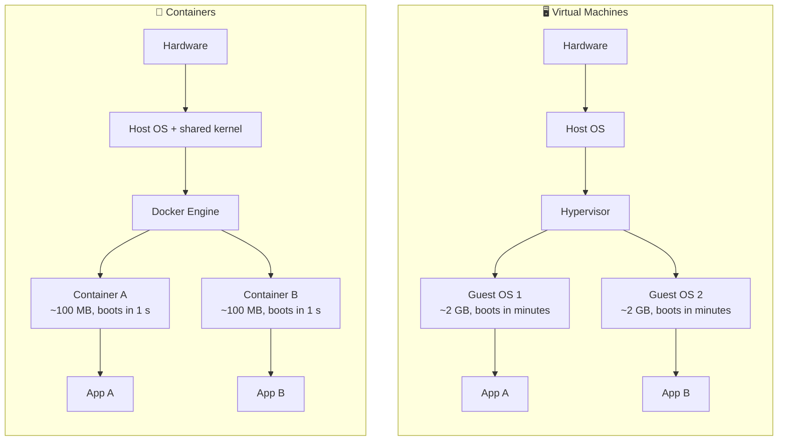
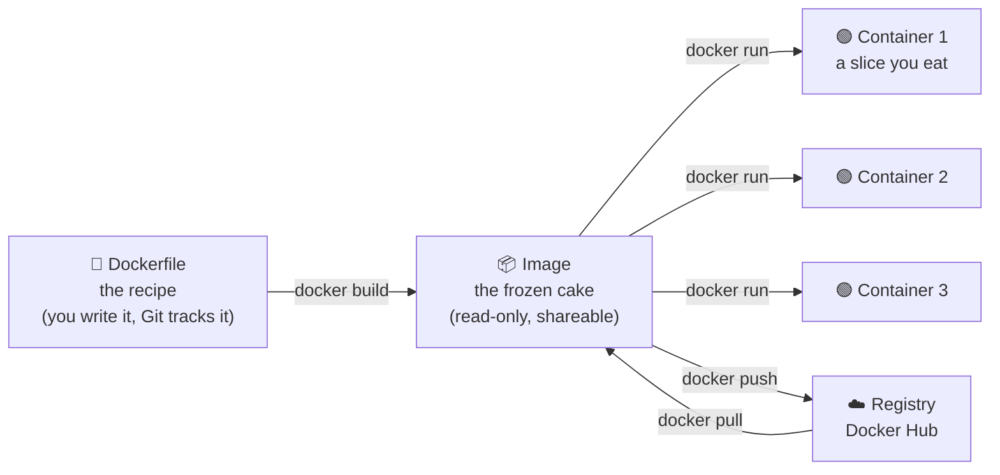
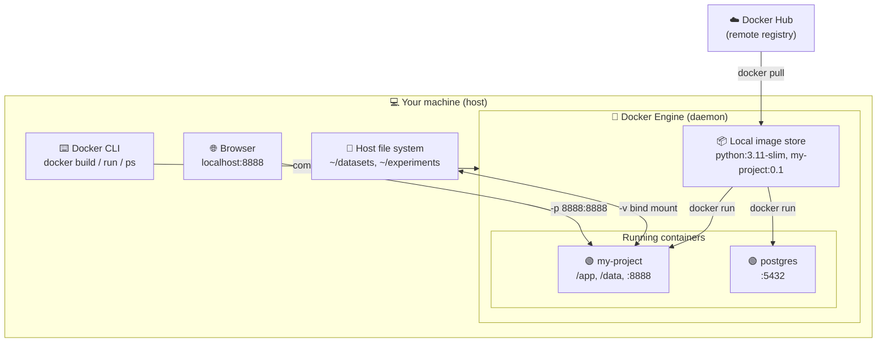
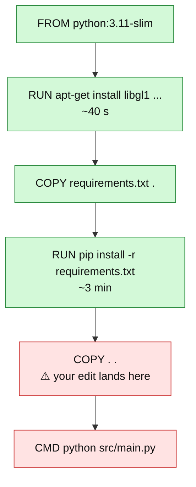
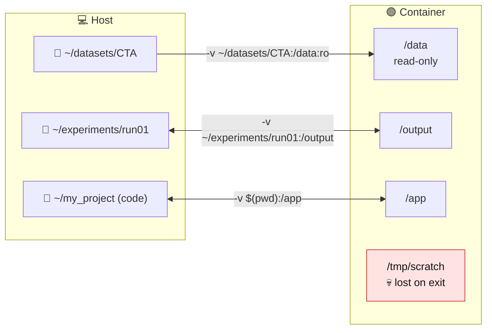
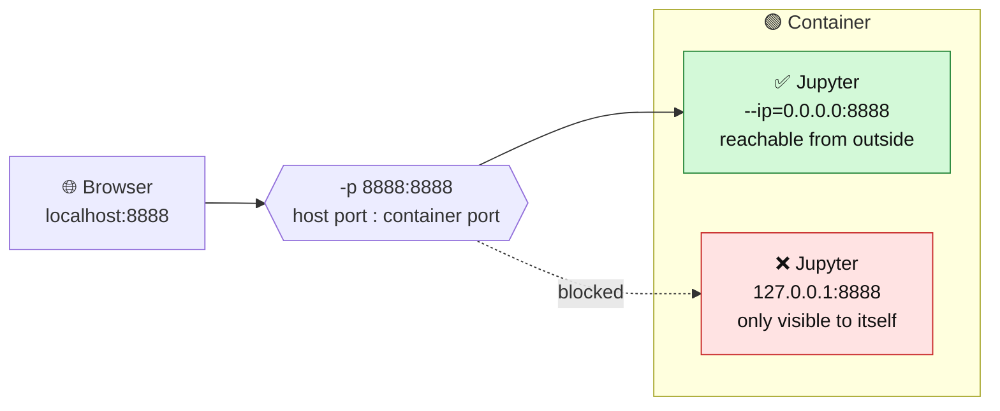
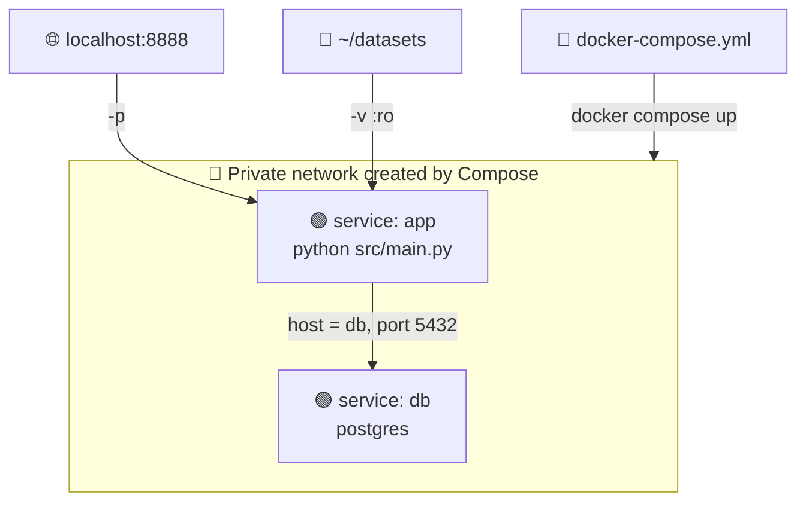

[Back to Index 🗂️](./README.md)

<center><h1>🐳 Docker Guide</h1></center>

A beginner-friendly guide to Docker: what it is, why it exists, and how to use it for Python and Deep Learning projects. **No prior knowledge is assumed** — if you have never opened a terminal for anything more than `pip install`, you are in the right place.

<br>

## 🗂️ Table of Contents
1. [The Problem Docker Solves](#1️⃣-the-problem-docker-solves)
2. [The Three Words You Must Know](#2️⃣-the-three-words-you-must-know)
3. [Installation](#3️⃣-installation)
4. [Your First Container](#4️⃣-your-first-container)
5. [Essential Commands](#5️⃣-essential-commands)
6. [Writing Your First Dockerfile](#6️⃣-writing-your-first-dockerfile)
7. [Layers and Build Cache](#7️⃣-layers-and-build-cache)
8. [Volumes: Getting Data In and Out](#8️⃣-volumes-getting-data-in-and-out)
9. [Ports: Reaching a Service Inside the Container](#9️⃣-ports-reaching-a-service-inside-the-container)
10. [Environment Variables](#-environment-variables)
11. [Docker Compose](#-docker-compose)
12. [Docker for Deep Learning (GPU)](#-docker-for-deep-learning-gpu)
13. [Common Errors and How to Fix Them](#-common-errors-and-how-to-fix-them)
14. [Best Practices](#-best-practices)
15. [Cheat Sheet](#-cheat-sheet)

<br>

## 1️⃣ The Problem Docker Solves

You finish a project, push it to GitHub, and a colleague clones it. Ten minutes later:

> *"It doesn't work on my machine."*

Why? Because your code never runs alone. It runs on top of a **whole stack of things you forgot you had**: a specific Python version, a specific CUDA driver, a system library like `libgl1` that OpenCV silently needs, an environment variable, a specific OS.

`requirements.txt` only captures the Python layer. Everything below it — the operating system, the system libraries, the compilers — is invisible and unversioned.

**Docker packages the entire stack**, from the operating system upward, into a single file that runs identically on your laptop, on the lab server, and in the cloud.

```
Without Docker                      With Docker
─────────────────────               ─────────────────────
your code            ✅ shared       your code            ✅ shared
Python packages      ⚠️ maybe        Python packages      ✅ shared
Python version       ❌ not shared   Python version       ✅ shared
system libraries     ❌ not shared   system libraries     ✅ shared
operating system     ❌ not shared   operating system     ✅ shared
```

### Docker vs Virtual Machine

A **virtual machine** emulates a whole computer, including a full guest operating system: heavy (gigabytes), slow to boot (minutes).

A **container** shares the kernel of the host machine and isolates only the file system and the processes: light (megabytes), starts in a second.

> Think of a VM as building a new house, and a container as renting a locked room in the house you already have.



The whole difference is the **duplicated guest OS**: a VM ships one, a container borrows the host's kernel.

### Docker vs venv / conda

They solve **overlapping but different** problems, and they compose well:

| | `venv` / `conda` | Docker |
|---|---|---|
| Isolates Python packages | ✅ | ✅ |
| Isolates the Python version | ⚠️ conda yes, venv no | ✅ |
| Isolates system libraries (CUDA, ffmpeg, libgl) | ❌ | ✅ |
| Reproducible on another OS | ❌ | ✅ |
| Weight | MB | GB |
| Setup effort | seconds | minutes |

Rule of thumb: **`venv` while developing alone, Docker when the project has to leave your machine** (a colleague, a server, a cluster, a paper reviewer, a deployment).

<br>

## 2️⃣ The Three Words You Must Know

Almost all beginner confusion comes from mixing these three up. They form a pipeline:



- **Dockerfile** → a plain text file with the instructions to build your environment. You write it, you commit it to Git.
- **Image** → the read-only result of building the Dockerfile. Frozen, immutable, shareable. *Nothing runs inside an image.*
- **Container** → a running instance of an image. You can start many containers from the same image. When it stops, anything written inside it is lost (unless you used a volume, see §8).

Two more words you will meet immediately:

- **Registry** → an online store of images. The public default is [Docker Hub](https://hub.docker.com). `python`, `ubuntu`, `postgres`, `pytorch/pytorch` all live there.
- **Tag** → the version label of an image, written after a colon: `python:3.11-slim`. The tag `latest` is *not* a version — it just means "whatever was pushed last", so never rely on it for reproducibility.

### The big picture

This is the map of everything you will touch — keep it in mind while reading the rest of the guide:



Notice the two bridges crossing the container wall: **`-v` for files** and **`-p` for network**. Everything else inside a container is sealed off from your machine — that is the entire point.

<br>

## 3️⃣ Installation

**macOS / Windows** → install [Docker Desktop](https://www.docker.com/products/docker-desktop/). It includes the engine, the CLI, and a small Linux VM (containers are Linux-native, so on macOS/Windows they run inside that hidden VM — this is normal and transparent).

**Linux** → install Docker Engine following the [official docs](https://docs.docker.com/engine/install/). Then add yourself to the `docker` group so you don't need `sudo` on every command:

```bash
sudo usermod -aG docker $USER
# log out and back in for the change to take effect
```

**Verify the installation:**

```bash
docker --version
docker run hello-world
```

If the second command prints a welcome message, everything works. Behind the scenes Docker just downloaded a tiny image from Docker Hub, started a container from it, printed the message, and exited.

> **On a lab server you may not have Docker permissions.** Ask the admin, or check whether they provide **Singularity/Apptainer** instead — it is the HPC-friendly alternative and it can convert Docker images.

<br>

## 4️⃣ Your First Container

You don't need to write anything to start using Docker. Run an official Python image interactively:

```bash
docker run -it --rm python:3.11-slim bash
```

You are now inside a minimal Linux machine with Python 3.11 installed. Try:

```bash
python --version
pip install numpy
python -c "import numpy; print(numpy.__version__)"
exit
```

Run the same command again: `numpy` is **gone**. This is the single most important thing to internalize — *a container is disposable*. Every change you make inside it disappears when it is removed. Anything you want to keep must be either baked into the image (§6) or stored in a volume (§8).

**The flags, one by one:**

| Flag | Meaning |
|---|---|
| `-i` | interactive — keep the input stream open |
| `-t` | allocate a terminal (so you get a proper shell prompt) |
| `-it` | the two above combined, the usual way to write it |
| `--rm` | delete the container as soon as it exits (keeps your machine clean) |
| `-d` | detached — run in the background |
| `--name mycontainer` | give the container a readable name instead of a random one |
| `-p 8888:8888` | publish a port (§9) |
| `-v /host/path:/container/path` | mount a folder (§8) |
| `-e VAR=value` | set an environment variable (§10) |

<br>

## 5️⃣ Essential Commands

```bash
# --- Images ---
docker images                  # list local images
docker pull ubuntu:22.04       # download an image without running it
docker rmi ubuntu:22.04        # delete an image

# --- Containers ---
docker ps                      # list RUNNING containers
docker ps -a                   # list ALL containers, including stopped ones
docker stop mycontainer        # stop gracefully
docker rm mycontainer          # delete a stopped container
docker logs mycontainer        # see what the container printed
docker logs -f mycontainer     # follow the logs live (like tail -f)

# --- Get a shell inside a RUNNING container ---
docker exec -it mycontainer bash

# --- Copy files between host and container ---
docker cp mycontainer:/app/results.csv ./results.csv

# --- Cleanup (Docker eats disk space, be aware) ---
docker system df               # how much space is Docker using?
docker system prune            # remove stopped containers, unused networks, dangling images
docker system prune -a         # ALSO remove all unused images — aggressive, re-download needed
```

> `docker run` creates a **new** container from an image. `docker exec` enters an **existing running** one. Beginners often use `run` when they mean `exec` and end up with dozens of dead containers — check with `docker ps -a`.

<br>

## 6️⃣ Writing Your First Dockerfile

Say you have this project:

```bash
my_project/
├── Dockerfile
├── .dockerignore
├── requirements.txt
└── src/
    └── main.py
```

**Dockerfile:**

```dockerfile
# 1. Start from an existing image (the "base"), never from nothing
FROM python:3.11-slim

# 2. Install system-level dependencies (this is the layer venv cannot give you)
RUN apt-get update && apt-get install -y --no-install-recommends \
    libgl1 \
    libglib2.0-0 \
    && rm -rf /var/lib/apt/lists/*

# 3. Set the working directory inside the container
WORKDIR /app

# 4. Copy ONLY the requirements first (see §7 — this is not a typo)
COPY requirements.txt .

# 5. Install the Python dependencies
RUN pip install --no-cache-dir -r requirements.txt

# 6. Now copy the rest of the source code
COPY . .

# 7. The default command executed when the container starts
CMD ["python", "src/main.py"]
```

**The instructions you will actually use:**

| Instruction | What it does |
|---|---|
| `FROM` | the base image to build on top of. Always the first line. |
| `WORKDIR` | sets the current directory (and creates it if missing) |
| `COPY src dst` | copies files from your machine into the image |
| `RUN` | executes a command **at build time**, and freezes the result into the image |
| `ENV` | sets an environment variable inside the image |
| `EXPOSE 8000` | documentation only — it declares a port, it does not publish it (`-p` does) |
| `CMD` | the default command **at run time**, easily overridden |
| `ENTRYPOINT` | the fixed command at run time; `CMD` becomes its arguments |

> `RUN` happens once, when you build. `CMD` happens every time you start a container. Confusing the two is the most common Dockerfile mistake.

**`.dockerignore`** — same idea as `.gitignore`. Without it, `COPY . .` will happily copy your 40 GB dataset and your `venv/` into the image:

```
venv/
__pycache__/
*.pyc
.git/
data/
*.nii.gz
notebooks/
.DS_Store
```

**Build and run:**

```bash
# Build the image and tag it (the trailing dot = "the Dockerfile is in this folder")
docker build -t my-project:0.1 .

# Run it
docker run --rm my-project:0.1

# Run it, but override the default CMD (useful for debugging)
docker run --rm -it my-project:0.1 bash
```

<br>

## 7️⃣ Layers and Build Cache

Every instruction in a Dockerfile creates a **layer**, and Docker caches layers. When you rebuild, it reuses cached layers until it hits the first instruction whose inputs changed — from there on, everything is rebuilt.

This is why step 4 and step 6 are separate:

```dockerfile
COPY requirements.txt .            # changes rarely
RUN pip install -r requirements.txt  # slow (minutes) — stays cached
COPY . .                           # changes on every single edit
```

You edit `main.py` → only the last layer is invalidated → rebuild takes **2 seconds**.

If instead you had written:

```dockerfile
COPY . .                           # ❌ changes on every edit
RUN pip install -r requirements.txt  # ❌ therefore re-runs every time
```

then editing one line of code would reinstall PyTorch. Every time.

Visually, when you edit `main.py` and rebuild:



🟩 = reused from cache &nbsp;&nbsp; 🟥 = rebuilt

Everything **above** the changed instruction is reused; everything **from it downward** is rebuilt. Move `COPY . .` to the top and the red zone swallows the 3-minute `pip install`.

**Order your Dockerfile from least-frequently-changing to most-frequently-changing.** That is the whole rule.

<br>

## 8️⃣ Volumes: Getting Data In and Out

Containers are disposable, but your datasets and results are not. A **bind mount** connects a folder on your machine to a folder inside the container — same files, two views, live in both directions.



One-way arrow = read-only. Two-way arrow = changes propagate both ways instantly. Anything **not** mounted (like `/tmp/scratch`) dies with the container.

```bash
docker run --rm -it \
  -v /home/user/datasets/CTA:/data:ro \
  -v /home/user/experiments/run01:/output \
  my-project:0.1
```

- `-v HOST_PATH:CONTAINER_PATH` → always absolute paths on the host side.
- `:ro` → read-only. **Use it for your datasets.** A bug in your script cannot then delete 130 CT scans.
- Whatever the container writes into `/output` appears immediately in `run01/` on your machine and survives the container's death.

**Mount your source code during development** so you don't rebuild on every edit:

```bash
docker run --rm -it -v "$(pwd)":/app my-project:0.1 bash
```

Now editing `main.py` in your IDE changes it instantly inside the container. Build the image *without* the mount when you want a frozen, shippable version.

> **Named volumes** (`-v mydata:/data`, no leading slash) are managed by Docker itself and live outside your file system. They are the right choice for database storage; for research data, bind mounts are usually what you want because you can see the files.

> **Permissions on Linux:** files created by the container may end up owned by `root`. Fix by running as yourself: `docker run --user $(id -u):$(id -g) ...`.

<br>

## 9️⃣ Ports: Reaching a Service Inside the Container

A container has its own private network. If something listens on port 8888 inside it, your browser cannot see it until you **publish** the port with `-p HOST:CONTAINER`.



Jupyter example:

```bash
docker run --rm -it \
  -p 8888:8888 \
  -v "$(pwd)":/app \
  my-project:0.1 \
  jupyter lab --ip=0.0.0.0 --port=8888 --no-browser --allow-root
```

Then open `http://localhost:8888` on your machine.

> `--ip=0.0.0.0` is mandatory. By default Jupyter binds to `127.0.0.1`, which inside a container means "only this container" — your host would never reach it. This one line accounts for a large share of *"I published the port and it still doesn't work"*.

The two numbers are independent: `-p 9000:8888` means "reach it at `localhost:9000` on my machine, it is 8888 inside". Handy when port 8888 is already taken.

<br>

## 🔟 Environment Variables

Use them for anything that changes between machines: paths, API keys, hyperparameters, `CUDA_VISIBLE_DEVICES`.

```bash
# One at a time
docker run --rm -e EPOCHS=50 -e LR=0.001 my-project:0.1

# Or from a file
docker run --rm --env-file .env my-project:0.1
```

`.env`:
```
EPOCHS=50
LR=0.001
DATA_ROOT=/data
```

Read them in Python:

```python
import os
epochs = int(os.environ.get("EPOCHS", 10))
```

> **Never `COPY` secrets into an image and never hardcode them in the Dockerfile.** Image layers are permanent — deleting a key in a later layer does not remove it from the earlier one, and anyone with the image can read it back. Pass secrets at run time, and add `.env` to both `.gitignore` and `.dockerignore`.

<br>

## 1️⃣1️⃣ Docker Compose

Once your `docker run` line grows to six flags, you stop remembering it. Compose moves the whole command into a file.

**`docker-compose.yml`:**

```yaml
services:
  app:
    build: .                     # build from the Dockerfile in this folder
    image: my-project:0.1
    volumes:
      - ./:/app                  # relative paths are allowed here
      - /home/user/datasets:/data:ro
    ports:
      - "8888:8888"
    env_file:
      - .env
    command: python src/main.py
```

Then:

```bash
docker compose up          # build if needed, and start
docker compose up -d       # in the background
docker compose logs -f     # follow the output
docker compose down        # stop and remove everything
docker compose run app bash  # one-off shell in the same environment
```

Compose is also how you run **multiple containers together** (an app plus a database, for example) — each becomes a service, and services reach each other **by name** instead of by IP:



Inside `app`, the database hostname is literally `db` — no IP addresses, no `localhost` juggling.

<br>

## 1️⃣2️⃣ Docker for Deep Learning (GPU)

Docker isolates system libraries, but the GPU driver lives in the host kernel. To expose it:

1. Install the **NVIDIA Container Toolkit** on the *host* (Linux only — GPU passthrough does not work on Docker Desktop for macOS, and Apple Silicon MPS is not available inside containers either).
2. Add `--gpus` to your run command:

```bash
docker run --rm -it --gpus all my-project:0.1 nvidia-smi
docker run --rm -it --gpus '"device=0,1"' my-project:0.1   # only GPU 0 and 1
```

**Choosing a base image:**

```dockerfile
# Option A: official PyTorch image — batteries included, several GB
FROM pytorch/pytorch:2.3.0-cuda12.1-cudnn8-runtime

# Option B: CUDA base, install PyTorch yourself — more control
FROM nvidia/cuda:12.1.0-cudnn8-runtime-ubuntu22.04
```

Match the **CUDA version in the image** to what your host driver supports (`nvidia-smi` on the host tells you the maximum). The driver stays on the host; the CUDA *runtime* comes from the image.

**Two flags worth knowing for training runs:**

```bash
--shm-size=8g     # PyTorch DataLoader with num_workers>0 crashes on the default 64MB /dev/shm
--ipc=host        # alternative to the above
```

<br>

## 1️⃣3️⃣ Common Errors and How to Fix Them

**`permission denied while trying to connect to the Docker daemon socket`**
You are not in the `docker` group. `sudo usermod -aG docker $USER`, then log out and back in.

**`bind: address already in use`**
Something already occupies that host port. Change the left number: `-p 8889:8888`.

**The container exits immediately**
Its main process finished. A container lives exactly as long as its `CMD` does — `docker run ubuntu` exits instantly because there is nothing to do. Use `-it ... bash` for an interactive session, and `docker logs <name>` to see why it died.

**My code changes are not reflected**
Either you copied the code into the image (`COPY . .`) and need to rebuild, or you meant to bind-mount it (§8).

**`no space left on device`**
Old images and dead containers. `docker system df`, then `docker system prune -a`.

**`exec format error` on Apple Silicon (M1/M2/M3/M4)**
You are running an `amd64` image on an `arm64` machine, or vice versa. Force the architecture:
```bash
docker build --platform linux/amd64 -t my-project:0.1 .
docker run --platform linux/amd64 --rm my-project:0.1
```
Emulation works but is slow — build native `arm64` images when you can, and `amd64` when the target is a lab server.

**`ImportError: libGL.so.1: cannot open shared object file`**
The classic OpenCV-in-a-slim-image error. The Python wheel is installed, the *system* library is not. Add it in a `RUN apt-get install` (see §6), or use `opencv-python-headless`.

**The build is enormous / very slow**
Check your `.dockerignore`. If `docker build` prints a multi-GB "sending build context", you are shipping your dataset into the build.

<br>

## 1️⃣4️⃣ Best Practices

- ✅ **Pin your versions.** `python:3.11-slim`, not `python:latest`. Reproducibility is the entire point.
- ✅ **Prefer `-slim` base images** over full ones; they are ~10x smaller. Use `-alpine` only if you know why — it uses a different C library and breaks many scientific wheels.
- ✅ **Always write a `.dockerignore`** before the first build.
- ✅ **Order instructions from stable to volatile** (§7).
- ✅ **Chain `apt-get` commands and clean up in the same `RUN`** — a separate `RUN rm` does not shrink the previous layer.
- ✅ **Mount datasets read-only** (`:ro`).
- ✅ **Never bake secrets or data into images.**
- ✅ **Commit the `Dockerfile`, the `.dockerignore` and the `docker-compose.yml`** to Git — they are source code, and they are what makes your paper's results reproducible.
- ✅ **One concern per container.** Not "one process", but not "an entire OS with 5 services" either.

<br>

## 1️⃣5️⃣ Cheat Sheet

```bash
# Build
docker build -t name:tag .
docker build --no-cache -t name:tag .        # ignore the cache

# Run
docker run --rm -it name:tag bash            # interactive, auto-cleanup
docker run -d --name web -p 8080:80 nginx    # background service
docker run --rm -v "$(pwd)":/app name:tag    # mount current folder
docker run --rm --gpus all name:tag          # with GPU

# Inspect
docker ps -a                                 # all containers
docker images                                # all images
docker logs -f container                     # follow output
docker exec -it container bash               # shell into a running container
docker inspect container                     # full JSON details

# Clean
docker stop container && docker rm container
docker rmi name:tag
docker system prune -a

# Compose
docker compose up -d
docker compose logs -f
docker compose down
```

<br>

## 🎓 Summary

1. ✅ A **Dockerfile** is built into an **image**, which is run as a **container**.
2. ✅ Containers are **disposable** — anything you want to keep goes in a **volume**.
3. ✅ Put slow, stable steps early in the Dockerfile and your code last, so the cache works for you.
4. ✅ `-v` for files, `-p` for ports, `-e` for configuration, `--gpus` for training.
5. ✅ Pin every version, ignore every dataset, commit every Dockerfile.

If your project runs with `docker run`, it runs for everyone. 🚀

<br>
<br>
<br>

[Back to Index 🗂️](./README.md)
