[Back to Index 🗂️](./README.md)

<center><h1>🐍 What is Python?</h1></center>

Python is a high-level, interpreted programming language widely used in various fields. When working with Python, there are a few key concepts you should understand:

**1. Virtual Environment**: A virtual environment is an isolated workspace for Python projects. It allows you to manage dependencies for your project without interfering with the global Python installation or other projects. `venv` is the name of the **stdlib module** that creates one of the possible kinds of virtual environment — see the [Virtual Environments](#virtual-environments) chapter for the other options (Conda, uv).<br>
**2. Interpreter**: The Python interpreter is the program that reads and executes Python code. Depending on your setup, the interpreter could refer to the system Python, a version you installed manually, or one inside a virtual environment.<br>
**3. Script**: A script is a standalone Python file (with a `.py` extension) designed to perform a specific task when executed.<br>

  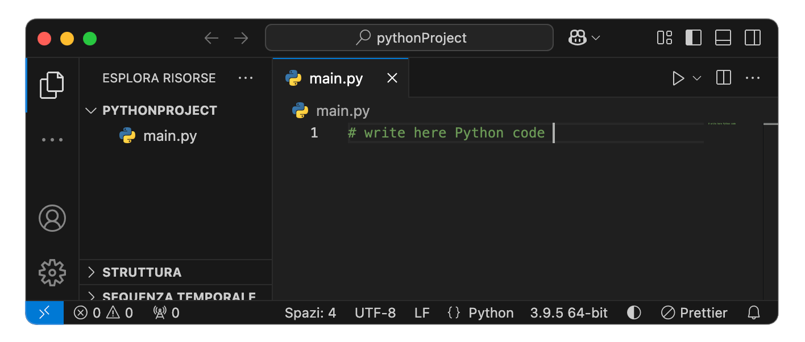

**4. Jupyter Notebook**: A Jupyter Notebook is an interactive web-based Python environment (with a `.ipynb` extension). Jupyter Notebooks are divided into **cells**, which can contain different types of content like Python code, Markdown text, Shell commands etc. Each cell runs independently, but variables persist throughout the notebook session. Cells can be run in any order, but dependencies between them must be managed carefully.<br>

  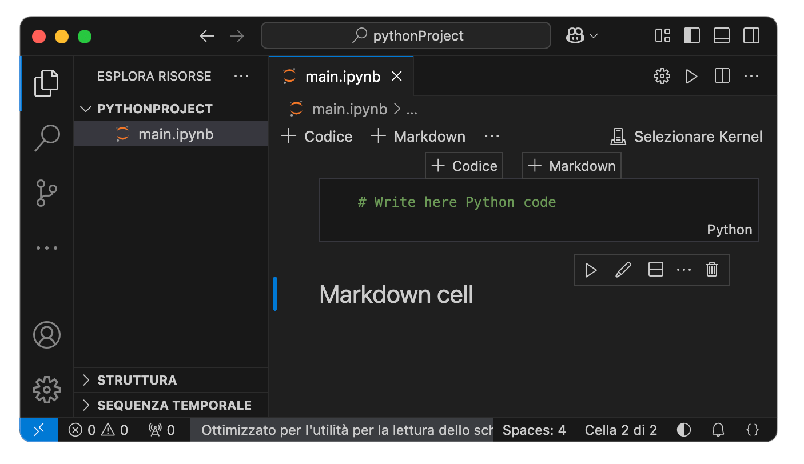

**5. Module**: A module is a Python file that contains reusable code, such as functions or classes, which can be imported into other Python files.<br>
**6. Package**: A package is a collection of modules organized into a directory structure.<br>

<br>

## ⌨️ Basic Python Commands

Below is a table summarizing essential Python commands and their differences across macOS, Linux, and Windows:

| **Purpose**                 | **macOS**               | **Linux**               | **Windows**             |
|----------------------------|------------------------|------------------------|------------------------|
| Check installed Python version | `python3 --version` or `python3 -V`   | `python3 --version` or `python3 -V`      | `py --version`          |
| Find the path of the active Python interpreter | `which python3`          | `which python3`          | `where python`         |
| Locate all installed paths of Python 3 | `which -a python3`          | `which -a python3`          | `where python`         |
| Run a Python script        | `python3 your_script.py` | `python3 your_script.py` | `py your_script.py`     |

> **Note**: `where` is a Windows command; on macOS/Linux the shell builtin `where` only exists in `zsh`, not `bash`. Use `which -a` (works in both) to list every match on the `PATH`.

<br>

## 🚨 Python3 vs Python2

Python 2 and Python 3 are distinct versions of the Python programming language, with Python 3 being the latest and actively supported version. Here are the key differences and considerations:

- **Python 2:** Use the command `python2` to access Python 2 (if installed).
- **Python 3:** Use the command `python3` to access Python 3.

On modern systems `python` might not be available. To ensure compatibility, always specify `python3` when working with Python 3.

- macOS and Linux systems often include a system-managed version of Python for internal operations (e.g., Python 2.x or 3.x). **Do not modify or remove it** — the OS itself (package managers, system scripts) may depend on it. See the [⚠️ system Python warning](#-remove-python) below.

To check the version of Python installed:
- For Python 2: `python2 --version`
- For Python 3: `python3 --version`

If you want `python` to refer to Python 3, you can create an alias in your shell configuration file (e.g., `~/.bashrc` or `~/.zshrc`):
```bash
alias python='python3'
```
After adding this, apply the changes by restarting the terminal or running:
```bash
source ~/.zshrc   # or source ~/.bashrc, matching whichever file you edited
```
Be cautious with this change, as some older scripts may require `python` to refer to Python 2. Personally, I don't suggest to do that.

<br>
<br>
<br>

<center><h1>🦾 Install Python</h1></center>

It is recommended to avoid using the system Python for development. Instead, install a separate version of Python to avoid conflicts. Python can be installed on macOS, Linux, and Windows using different methods.

<br>

## macOS 🍎

### 1. Using the Official Python Installer
- Visit [python.org/downloads](https://www.python.org/downloads/).
- Download the macOS installer for the desired Python version.
- Follow the installation prompts.
- After installation, verify with:
  ```bash
  python3 --version
  ```

### 2. Using Homebrew
- Ensure Homebrew is installed. If not, install it:
  ```bash
  /bin/bash -c "$(curl -fsSL https://raw.githubusercontent.com/Homebrew/install/HEAD/install.sh)"
  ```
- Install Python:
  ```bash
  brew install python
  ```
- Verify installation:
  ```bash
  python3 --version
  ```

<br>

## Linux 🐧

### 1. Using the Package Manager
- Update the package manager and install Python, along with `venv` and `pip` (on Debian/Ubuntu these are **separate packages**, not bundled with `python3`):
  ```bash
  sudo apt update
  sudo apt install python3 python3-venv python3-pip
  ```
- Verify installation:
  ```bash
  python3 --version
  ```
> **Note**: to install a specific Python version not shipped by your distro (e.g. a newer release on an older Ubuntu LTS), use the [deadsnakes PPA](https://launchpad.net/~deadsnakes/+archive/ubuntu/ppa): `sudo add-apt-repository ppa:deadsnakes/ppa`, then `sudo apt install python3.12 python3.12-venv`.

### 2. Building from Source
- Download the source code from [python.org](https://www.python.org/).
- Extract the archive and compile Python:
  ```bash
  tar -xvzf Python-<version>.tgz
  cd Python-<version>
  ./configure --enable-optimizations
  make -j "$(nproc)"
  sudo make altinstall
  ```
- Verify installation:
  ```bash
  python3.x --version
  ```

> ⚠️ **Never run `sudo make install` here** — it overwrites the system's own `/usr/bin/python3`, which the OS package manager and system scripts depend on. Always use `make altinstall`, which installs as `python3.x` without touching the system binary.

<br>

## Windows 🪟

### 1. Using the Official Python Installer
- Visit [python.org/downloads](https://www.python.org/downloads/).
- Download the Windows installer for the desired Python version.
- During installation, select "Add Python to PATH."
- Verify installation:
  ```bash
  py --version
  ```

### 2. Using Microsoft Store
- Open the Microsoft Store and search for "Python."
- Select and install the desired Python version.
- Verify installation:
  ```bash
  py --version
  ```

<br>
<br>
<br>

<center><h1>📦 Installing Python Packages</h1></center>

Python includes `pip`, the default package installer, which simplifies the process of managing additional libraries and dependencies. Typically, `pip` is installed alongside Python, but if it's missing, you can install it manually:

<br>

## ⚙️ Installing `pip`
To install `pip`, download and run the `get-pip.py` script from the official site:
```bash
curl -O https://bootstrap.pypa.io/get-pip.py
python3 get-pip.py
```

or try:

```bash
python3 -m ensurepip --upgrade
```
> **Note**: on Debian/Ubuntu, `ensurepip` may be stripped from the system Python; in that case use the `apt install python3-pip` route shown above instead.

<br>

## ⌨️ Basic `pip` Commands
Here are some commonly used `pip` commands to manage Python packages:

| **Command**                    | **Purpose**                                      |
|--------------------------------|--------------------------------------------------|
| `pip3 --version` or `pip3 -V`  | Check the installed version of `pip`.            |
| `pip3 list`                    | List all installed Python packages.              |
| `pip3 install <package_name>`  | Install a specific Python package.               |
| `pip3 uninstall <package_name>`| Uninstall a specific Python package.             |
| `pip3 show <package_name>`     | Show detailed information about a package.       |
| `pip3 install --upgrade pip`   | Upgrade `pip` to the latest version.             |
| `which pip3`                   | Locate the `pip3` executable path (macOS/Linux). |
| `where pip3`                   | Locate the `pip3` executable path (Windows).     |

<br>

### Notes
1. Avoid using the system-installed Python for development (macOS and Linux already come with a Python interpreter used by the operating system), as it may conflict with system operations.
2. If managing multiple projects with different package versions, consider using virtual environments to isolate dependencies. When a package is installed, it will be stored alongside the Python interpreter, unless a virtual environment is created and **activated** first.
3. Inside an activated virtual environment, use the plain `python`/`pip` commands (no `3` suffix needed) — the environment's own interpreter is already the one on `PATH`. `pip` ships bundled with every `venv`/`uv` environment automatically; there's no separate install step.

<br>
<br>
<br>

<center><h1>❌ Remove Python</h1></center>

<br>

## macOS 🍎:

### 1. via Python Installer
If you installed Python using the Python.org installer, manually remove it:
```bash
sudo rm -rf /Library/Frameworks/Python.framework/Versions/<your_version>
```
Check for symlinks:
```bash
ls -l /usr/local/bin | grep python
```
Remove symlinks:
```bash
sudo rm -f /usr/local/bin/python3.13
sudo rm -f /usr/local/bin/python3
sudo rm -f /usr/local/bin/pip3
```
Verify removal:
```bash
python3 --version
which -a python3
```

### 2. via Homebrew
List installed Python versions:
```bash
brew list | grep python
```
Uninstall:
```bash
brew uninstall python@<version>
```
Remove remaining symlinks:
```bash
rm -f /usr/local/bin/python3
rm -f /usr/local/bin/pip3
```
Check if installed in `/opt/homebrew/bin`:
```bash
rm -f /opt/homebrew/bin/python3
rm -f /opt/homebrew/bin/pip3
```
Verify:
```bash
brew list | grep python
python3 --version
which -a python3
```

<br>

## Windows 🪟:

### 1. via Windows Installer
If installed via the Python.org installer:
1. Open **Control Panel ➡️ Programs ➡️ Programs and Features**.
2. Locate **Python X.X**.
3. Click **Uninstall**.

Alternatively, remove it via PowerShell/cmd:
```powershell
winget uninstall Python.Python.3.x
```
Check Python installation path:
```powershell
where.exe python
```
Manually remove folders (if necessary):
```powershell
Remove-Item -Recurse -Force "C:\Users\<YourUsername>\AppData\Local\Programs\Python"
Remove-Item -Recurse -Force "C:\Program Files\Python*"
```
> **Note**: `where` alone is a PowerShell alias for `Where-Object`, not the file-finder — use `where.exe` explicitly, or `Get-Command python` as a PowerShell-native alternative.

<br>

## 🐧 Linux

> ⚠️ **Warning**: these commands only apply to a Python version **you installed yourself** (e.g. via deadsnakes, `pyenv`, or from source). **Never** run `apt remove`/`purge` on the distro's own `python3` package (usually the lowest version number, e.g. `python3.x-minimal` or matching your OS's default) — `apt` and many system scripts are themselves written in Python and depend on it. Removing it can break your package manager and require a system reinstall.

### 1. via Package Manager
For Debian-based systems (Ubuntu, Debian), removing a version installed from deadsnakes/PPA:
```bash
sudo apt-get remove --purge python3.x
sudo apt autoremove
```
For Red Hat-based systems (Fedora, CentOS):
```bash
sudo dnf remove python3.x
```
Check if Python is still installed:
```bash
python3 --version
which -a python3
```

<br>
<br>
<br>

<center><h1>🔄 Switching Between Installed Python Versions</h1></center>

For a single one-off switch, you can prepend the desired version's **directory** to `PATH` (macOS/Linux):
```bash
export PATH="/usr/local/opt/python@3.9/bin:$PATH"
```
> The path must point to the **directory containing the `python3` binary**, not to the binary itself — otherwise `PATH` resolution silently fails and the old version keeps being used.

Apply changes:
```bash
source ~/.zshrc  # or source ~/.bashrc
```
Verify the change:
```bash
python3 --version
```
On **Windows**, modify the system environment variables:
1. Search **"Environment Variables"**.
2. Edit **PATH** and move the desired Python version's folder to the top.
3. Restart the terminal and check with:
```powershell
python --version
```

> 💡 **Better approach**: manually juggling `PATH` doesn't scale past two versions and is easy to get wrong. For managing several Python versions side by side, use a dedicated version manager instead — [`pyenv`](https://github.com/pyenv/pyenv) (macOS/Linux) or `uv python install <version>` / `uv python pin <version>` (cross-platform, see the [uv workflow](#-uv-fast-all-in-one) below), which let you install multiple versions and switch per-project without touching `PATH` by hand.

<br>
<br>
<br>

<center><h1>🌀 Virtual Environments</h1></center>

Virtual environments allow you to create isolated Python environments for projects, ensuring that dependencies do not conflict with each other or with the system Python installation. This is especially useful when working on multiple projects with different package requirements.

There are three common tools to create them. They solve the same problem with different tradeoffs — pick one per project, don't mix them in the same project.

<br>

## 🧭 Which Tool?

| | `venv` + `pip` | Conda | uv |
|---|---|---|---|
| Extra install needed | None (Python stdlib) | Miniconda/Anaconda (~400 MB+) | one-line install script |
| Can install Python itself | ❌ (needs a Python already present) | ✅ | ✅ |
| Non-Python binary deps (CUDA, GDAL, ITK, MKL) | ❌ | ✅ (its whole reason to exist) | ❌ |
| Lockfile for reproducibility | manual (`pip freeze`) | `conda env export` | ✅ automatic `uv.lock` |
| Speed (create env / install) | baseline | slow | 10–100× faster than pip |
| Best for | simple pure-Python projects, quick scripts | Data Science / Deep Learning stacks needing compiled non-Python libraries | new projects, CI, anything where speed and reproducibility matter |

<br>

## 📋 Workflow Comparison

The same seven actions, one row per tool — use this as a cheat sheet once you've picked one:

| Step | `venv` + `pip` | Conda | uv |
|---|---|---|---|
| 1. Create | `python3 -m venv .venv` | `conda create -n myenv python=3.12` | `uv venv --python 3.12` (or `uv init` for a full project) |
| 2. Activate | `source .venv/bin/activate` | `conda activate myenv` | `source .venv/bin/activate` |
| 3. Install a package | `pip install numpy` | `conda install -c conda-forge numpy` | `uv add numpy` |
| 4. Record dependencies | `pip freeze > requirements.txt` (or `pipreqs .`, see [Deploying Python Code](#-deploying-python-code)) | `conda env export --from-history > environment.yaml` | automatic — written to `uv.lock` on every `uv add` |
| 5. Reproduce elsewhere | `pip install -r requirements.txt` | `conda env create -f environment.yaml` | `uv sync` |
| 6. Run code | `python script.py` | `python script.py` | `uv run script.py` (no activation needed) |
| 7. Delete | `rm -rf .venv` | `conda env remove -n myenv` | `rm -rf .venv` |

> **Convention**: name `venv`/`uv` folders `.venv` (leading dot). It's the tool-standard name auto-detected by VS Code, PyCharm, and `uv` itself, and is easy to exclude with a single `.gitignore` line. Conda environments aren't project folders — they live in a central location and are addressed by `--name`, so this convention doesn't apply to them.

<br>

## 🅰️ `venv` + `pip`

### ⭐️ Creating a Virtual Environment
Navigate to your project directory and create the environment:
   ```bash
   python3 -m venv .venv
   ```
   For a specific Python version:
   ```bash
   python3.x -m venv .venv
   ```

> **Note**: you can search for any `venv`/`uv` environment on your computer with `find ~ -name "pyvenv.cfg" 2>/dev/null` — it will output all the paths to `pyvenv.cfg` files, marking every `venv`-style folder on your device (`uv` environments also produce this file). It does **not** include system interpreters or Conda environments, which use a different layout.

### 🏁 Activating a Virtual Environment
To use the virtual environment, activate it:
- **macOS/Linux**:
  ```bash
  source .venv/bin/activate
  ```
- **Windows (PowerShell)**:
  ```powershell
  .\.venv\Scripts\Activate.ps1
  ```
  > If this fails with a script-execution error, PowerShell's execution policy is blocking it. Run once per user: `Set-ExecutionPolicy -Scope CurrentUser RemoteSigned`.
- **Windows (cmd.exe)**:
  ```cmd
  .\.venv\Scripts\activate.bat
  ```

Once activated, the terminal prompt will change to include the name of the virtual environment (e.g., `(.venv)`):
```bash
(.venv) user@machine:~$
```

### 📦 Installing Packages in a Virtual Environment
With the virtual environment activated, you can use `pip` to install packages. All the packages will be stored inside the active environment and they will not be visible from the other virtual environments:
```bash
pip install <package_name>
```

### 🛑 Deactivating a Virtual Environment
When you are done working, deactivate the environment:
```bash
deactivate
```
This returns the terminal to the global environment.

<br>

## 🅱️ Conda

Anaconda and Miniconda are the two common Conda distributions.
- **Anaconda**: A larger distribution that includes Python, conda, and many pre-installed data science libraries.
- **Miniconda**: A minimal installation that includes Python and conda, with fewer pre-installed libraries, providing more flexibility.

Reach for Conda specifically when your project needs **non-Python** binary dependencies (CUDA toolkits, GDAL, compiled scientific libraries) that `pip` can't build for you.

### 🔧 Installation

**macOS/Linux:**
1. Download the miniconda installer:
     ```bash
     # Linux
     wget https://repo.anaconda.com/miniconda/Miniconda3-latest-Linux-x86_64.sh
     # macOS (Apple Silicon)
     curl -O https://repo.anaconda.com/miniconda/Miniconda3-latest-MacOSX-arm64.sh
     # macOS (Intel)
     curl -O https://repo.anaconda.com/miniconda/Miniconda3-latest-MacOSX-x86_64.sh
     ```
   To download a different version check [here](https://repo.anaconda.com/miniconda/) and use:
     ```bash
     # Replace <FILENAME> with the installer Filename you copied from the archive
     curl -O https://repo.anaconda.com/miniconda/<FILENAME>
     ```
2. Check file integrity:
     ```bash
     # Linux
     sha256sum <FILE_NAME>
     # macOS
     shasum -a 256 <FILE_NAME>
     ```
   Compare the hash value you see with the value [here](https://repo.anaconda.com/miniconda/). Remember to verify the hash corresponding to your downloaded miniconda version.

3. Install miniconda:
     ```bash
     bash ~/Miniconda3-latest-<platform>.sh
     ```
   Follow the instruction by pressing `Enter` and write `yes`.

4. Apply modifications: Close and re-open your terminal window for the installation to fully take effect, or use the following command to refresh the terminal:
     ```bash
     # Bash shell (Linux)
     source ~/.bashrc
     # Zsh shell (macOS)
     source ~/.zshrc
     ```

More about the procedure for different systems and shells [here](https://www.anaconda.com/docs/getting-started/miniconda/install#macos-linux-installation:to-download-a-different-version).

**Windows:**
1. Download the installer from the [official site](https://www.anaconda.com/).
2. Run the installer and follow the instructions.
3. Anaconda **recommends against** adding conda to the system PATH during install (it can conflict with other software); use the "Anaconda Prompt" it creates instead, or run `conda init` afterward from that prompt if you want conda available in your regular terminal.

<br>

### 🛜 Installing Miniconda Remotely (e.g. on a server)

1. Create a directory for Miniconda:
   ```bash
   mkdir -p ~/miniconda3
   ```
2. Download the Miniconda installer and save it as specified:
   ```bash
   wget https://repo.anaconda.com/miniconda/Miniconda3-latest-Linux-x86_64.sh -O ~/miniconda3/miniconda.sh
   ```
3. Execute the script in non-interactive mode, updating an existing install if one is already there, with install prefix (target directory) set to `~/miniconda3`:
   ```bash
   bash ~/miniconda3/miniconda.sh -b -u -p ~/miniconda3
   ```
4. Remove the installer:
   ```bash
   rm -rf ~/miniconda3/miniconda.sh
   ```
5. Register conda with your shell (edits `~/.bashrc`/`~/.zshrc` — still requires reopening the terminal or `source`-ing the file to take effect):
   ```bash
   ~/miniconda3/bin/conda init bash   # or: conda init zsh
   ```

<br>

### ⌨️ Basic Conda Commands

| **Purpose**                              | **Command**                               | **Description**                                                                      |
|---------------------------------------|-------------------------------------------|--------------------------------------------------------------------------------------|
| **Create an environment**             | `conda create --name myenv` or `conda create --name myenv python=3.12`    | Creates a new environment named `myenv`. ⚠️ **Without `python=`, no Python interpreter is installed in it at all** — always specify a version.  |
| **Activate an environment**           | `conda activate myenv`                    | Activates the environment `myenv`.                                                  |
| **Deactivate an environment**         | `conda deactivate`                        | Deactivates the currently active environment.                                       |
| **Remove an environment**             | `conda env remove --name myenv`           | Deletes the environment `myenv` completely.                                         |
| **Install a package**                 | `conda install -c conda-forge <package_name>` | Installs a specific package into the active environment (`conda-forge` has broader, more current coverage than the `defaults` channel). |
| **Check conda version**               | `conda --version`                         | Displays the currently installed version of conda.                                  |
| **List installed packages**           | `conda list`                              | Lists all packages installed in the active environment.                             |
| **List all environments**             | `conda env list`                          | Displays all available environments and their locations.                            |

> `pip` already ships inside every Conda environment that specifies `python=`, no separate `conda install pip` step needed in that case.

<br>

### 🪛 Managing Conda Base Environment

By default, the `base` environment in Conda is activated whenever you open a new terminal.

  ```bash
  (base) user@machine:~$
  ```

Here are commands to manage this behavior:

-  **Prevent Conda Base Activation by Default**: To prevent the `base` environment from being activated automatically:

    ```bash
    conda config --set auto_activate_base false
    ```
    This ensures that Conda doesn't activate the `base` environment automatically in new terminals.

- **Show or Hide the `(base)` Prefix**: You can customize whether the `(base)` prefix appears in your terminal prompt. To hide the prefix:
    ```bash
    conda config --set changeps1 false
    ```
    To show the prefix:
    ```bash
    conda config --set changeps1 true
    ```

<br>

## 🅾️ uv (fast, all-in-one)

[`uv`](https://docs.astral.sh/uv/) is a newer, Rust-based tool from Astral that replaces the combination of `pyenv` + `venv` + `pip` + `pip-tools` with a single, much faster binary. It manages Python versions, virtual environments, and dependencies with an automatic lockfile.

### 🔧 Installation
```bash
# macOS/Linux
curl -LsSf https://astral.sh/uv/install.sh | sh
# macOS (Homebrew alternative)
brew install uv
```
```powershell
# Windows (PowerShell)
powershell -ExecutionPolicy ByPass -c "irm https://astral.sh/uv/install.ps1 | iex"
```

### 🐍 Managing Python Versions
`uv` can download and manage Python interpreters itself — no separate `pyenv` needed:
```bash
uv python install 3.12      # download and install a Python version
uv python list               # list installed/available versions
uv python pin 3.12           # pin the version for the current project
```

### 📁 Starting a Project
```bash
uv init my_project           # scaffolds pyproject.toml, .python-version, .venv/
cd my_project
```
This creates a `pyproject.toml` — the modern, PEP 621 config file that replaces `requirements.txt` as the source of truth for dependencies (see also [`PyPI-Guide.md`](./PyPI-Guide.md) §5 for packaging with `pyproject.toml`).

For an existing project, `uv venv` alone just creates a bare `.venv` without the project scaffolding.

### 📦 Managing Dependencies
```bash
uv add numpy                 # adds to pyproject.toml, updates uv.lock, installs it
uv add --dev pytest          # dev-only dependency
uv remove numpy              # removes it from both files
uv sync                      # installs exactly what uv.lock specifies (reproducible)
```

### ▶️ Running Code
```bash
uv run script.py             # runs inside the project's env — no manual activation needed
uv run python                # drop into a REPL with the project's env
```
`uv run` transparently syncs the environment to match the lockfile before every run, so it's always in sync — you don't have to remember to `uv sync` yourself.

### 🧰 One-off Tools
```bash
uvx ruff check .             # run a tool in a throwaway env, without installing it into your project
```
`uvx` is `uv`'s equivalent of `pipx`.

### 🔁 Compatibility with `pip`/`requirements.txt`
If you're not ready to move to `pyproject.toml`, `uv` also offers a drop-in faster replacement for the classic `pip` workflow:
```bash
uv venv .venv                          # same as python3 -m venv .venv, much faster
source .venv/bin/activate
uv pip install -r requirements.txt     # same as pip install -r requirements.txt
uv pip compile requirements.in -o requirements.txt   # pip-tools-style lockfile generation
```

<br>

## Why Use Virtual Environments?
1. **Dependency Management**: Avoid conflicts between dependencies required by different projects.
2. **Isolation**: Prevent system-wide changes by containing all packages within the virtual environment.
3. **Reproducibility**: Simplify sharing and collaboration for others to recreate the environment.

By using virtual environments, you maintain clean and organized project setups, reducing the risk of dependency issues.

<br>
<br>
<br>

<center><h1>📦 Deploying Python Code</h1></center>

When sharing or deploying Python projects, it is essential to specify dependencies. This ensures that anyone using the code has the correct libraries installed. This chapter covers the **detailed generation** of dependency files — see the [Workflow Comparison](#-workflow-comparison) table above for the one-liner used per tool.

<br>

## 📜 `requirements.txt` (for Pip-Based Environments)

A `requirements.txt` file lists the necessary Python packages and their versions. There are multiple tools to generate this file, each with different approaches:

<br>

### 🔧 Using `pipreqs` (Recommended for Projects)

`pipreqs` analyzes your project's import statements to generate a minimal `requirements.txt` with only the packages your code actually uses.

**Installation:**
```bash
pip install pipreqs
```

**Usage:**
```bash
# Navigate to your project directory
cd /path/to/your/project

# Generate requirements.txt
pipreqs . --force
```

**Advantages:**
- Only includes packages that are actually imported in your code
- Scans your project files to determine dependencies
- Creates a clean, minimal requirements file
- Useful for projects where you don't want to include all environment packages

**Options:**
```bash
pipreqs . --force              # Overwrite existing requirements.txt
pipreqs . --savepath custom.txt  # Save to a different filename
pipreqs . --ignore venv/,tests/  # Ignore specific directories
```

<br>

### 🧊 Using `pip freeze` (Environment Snapshot)

`pip freeze` captures all packages installed in your current Python environment, including their exact versions.

**Usage:**
```bash
pip freeze > requirements.txt
```

**Advantages:**
- Simple and built into pip (no installation needed)
- Captures exact versions for reproducibility
- Includes all dependencies and sub-dependencies

**Disadvantages:**
- Includes ALL packages in your environment, even those not used by your project
- Can create bloated requirements files
- May include system packages or development tools

**Best Practices:**
- Use within a **virtual environment** to avoid capturing system packages
- Consider using `pip list --format=freeze` for similar output
- Manually review and clean up the generated file if needed

**Example Output:**
```
certifi==2023.7.22
charset-normalizer==3.2.0
idna==3.4
numpy==1.24.3
pandas==2.0.3
python-dateutil==2.8.2
pytz==2023.3
requests==2.31.0
six==1.16.0
urllib3==2.0.4
```

<br>

### 🐍 Using `pigar` (Intelligent Analysis)

`pigar` is an advanced tool that analyzes your Python files to automatically generate `requirements.txt`, and can also check for missing or unused packages.

**Installation:**
```bash
pip install pigar
```

**Usage:**
```bash
# Generate requirements.txt in current directory
pigar generate

# Specify a different path
pigar generate -f /path/to/requirements.txt

# Include per-package source comments (see example below)
pigar generate --with-referenced-comments
```

**Advantages:**
- Analyzes actual imports in your code
- Provides comments showing where each package is used
- Can detect packages that are imported but not installed
- Can find packages installed but not imported

**Additional Commands:**
```bash
# Check for missing or redundant packages
pigar check

# Search for available package versions
pigar search numpy
```

**Example Output with Comments:**
```
# requirements.txt generated by pigar

# project/data_processing.py: 1,5
numpy==1.24.3

# project/analysis.py: 3
# project/data_processing.py: 2
pandas==2.0.3

# project/api.py: 7
requests==2.31.0
```

<br>

In summary:

| Tool | Scope | Speed | Accuracy | Comments | Built-in |
|------|-------|-------|----------|----------|----------|
| **pip freeze** | Entire environment | Fast | ⚠️ Includes unused packages | ❌ No | ✅ Yes |
| **pipreqs** | Project imports | Medium | ✅ Only used packages | ❌ No | ❌ No |
| **pigar** | Project imports | Medium | ✅ Only used packages | ✅ Yes | ❌ No |

<br>

- **Use `pip freeze`** when you want an exact snapshot of your working environment
- **Use `pipreqs`** for clean project deployment with minimal dependencies
- **Use `pigar`** when you want detailed tracking of where packages are used and need additional package management features
- **Use `uv add`** (see the [uv workflow](#-uv-fast-all-in-one) above) if starting fresh — it maintains `pyproject.toml`/`uv.lock` automatically as you go, so there's nothing to "generate" after the fact

<br>

## 📝 Writing Dependencies Manually

If writing dependencies manually, ensure you:
- Specify **package names and versions** to avoid compatibility issues
- Keep each dependency on a **new line**
- Use version constraints (`==`, `>=`, `<=`, `~=`) to define exact or flexible versions:

```txt
numpy>=1.21.0,<2.0.0  # Any version from 1.21.0 up to (but not including) 2.0.0
scipy==1.5.4          # Exact version 1.5.4
matplotlib>=3.0       # Version 3.0 or later
pandas~=1.3.0         # Compatible release (>=1.3.0, <1.4.0)
requests              # Any version (not recommended for production)
```

> Note: `requirements.txt` lists **package** dependencies only — it is not the place to pin the Python version itself. To require a Python version range, use `requires-python` in `pyproject.toml` (see [`PyPI-Guide.md`](./PyPI-Guide.md) §5), or `.python-version` for `pyenv`/`uv`.

**Version Specifier Guide:**
- `==` : Exact version
- `>=` : Greater than or equal
- `<=` : Less than or equal
- `>` : Greater than
- `<` : Less than
- `~=` : Compatible release (e.g., `~=1.3.0` means `>=1.3.0, <1.4.0`)
- `!=` : Exclude specific version

<br>

## 🛠️ `environment.yaml` (For Conda-Based Environments)

A `.yaml` (or `.yml`) file is used to define dependencies in **Conda environments**.

**To generate an environment file:**
```bash
# Export current environment
conda env export > environment.yaml

# Export without build specifications (more portable)
conda env export --no-builds > environment.yaml

# Export only explicitly installed packages
conda env export --from-history > environment.yaml
```

**To recreate an environment:**
```bash
# Create environment from file
conda env create -f environment.yaml

# Update existing environment
conda env update -f environment.yaml
```

**Example `environment.yaml`:**
```yaml
name: my_project_env
channels:
  - conda-forge
  - defaults
dependencies:
  - python=3.10
  - numpy=1.24.3
  - pandas=2.0.3
  - matplotlib>=3.5
  - scipy
  - pip
  - pip:
    - requests==2.31.0
    - beautifulsoup4
```

<br>

## 📥 Installing Dependencies

To install dependencies from a `requirements.txt` file:

```bash
pip install -r requirements.txt

# Or with pip3
pip3 install -r requirements.txt

# Upgrade all packages to specified versions
pip install --upgrade -r requirements.txt
```

<br>

## 🌟 Best Practices

1. **Use virtual environments** to isolate project dependencies
2. **Pin critical package versions** to ensure reproducibility
3. **Document your dependency generation method** in your project README
4. **Regularly update** your requirements file as your project evolves
5. **Test your requirements file** in a fresh environment before deployment
6. **Consider using `requirements-dev.txt`** for development-only dependencies
7. **Add comments** to explain why specific versions are pinned

<br>

## 🔒 Security Note

Regularly update your dependencies to patch security vulnerabilities:

```bash
# Check for outdated packages
pip list --outdated

# Use pip-audit (PyPA-maintained, free, no account needed) to check for known vulnerabilities
pip install pip-audit
pip-audit -r requirements.txt
```
> `safety check`/`safety scan` is a well-known alternative, but the `safety` CLI has moved toward a paid/account-gated model — `pip-audit` is the actively free, PyPA-endorsed option. If you use `uv`, `uv audit` covers the same need natively.

<br>
<br>
<br>

<center><h1>📓 Jupyter Notebooks and JupyterLab 🧪</h1></center>

Jupyter Notebooks and JupyterLab are popular tools for interactive programming in Python, especially for data analysis, visualization, and exploration.

<br>

## 📙 Installing Jupyter Notebook
1. Verify your Python and `pip` installation:
   ```bash
   python3 --version
   pip3 --version
   pip3 install --upgrade pip
   ```
2. Install Jupyter Notebook:
   ```bash
   pip3 install notebook
   ```
3. To uninstall:
   ```bash
   pip3 uninstall notebook
   ```

<br>

## 🏎️ Running Jupyter Notebook
Launch Jupyter Notebook with:
```bash
cd /path/to/your/project
source .venv/bin/activate
jupyter-notebook
```
This starts a local web server and opens the Jupyter interface in your default browser, allowing you to create, edit, and run Python files.

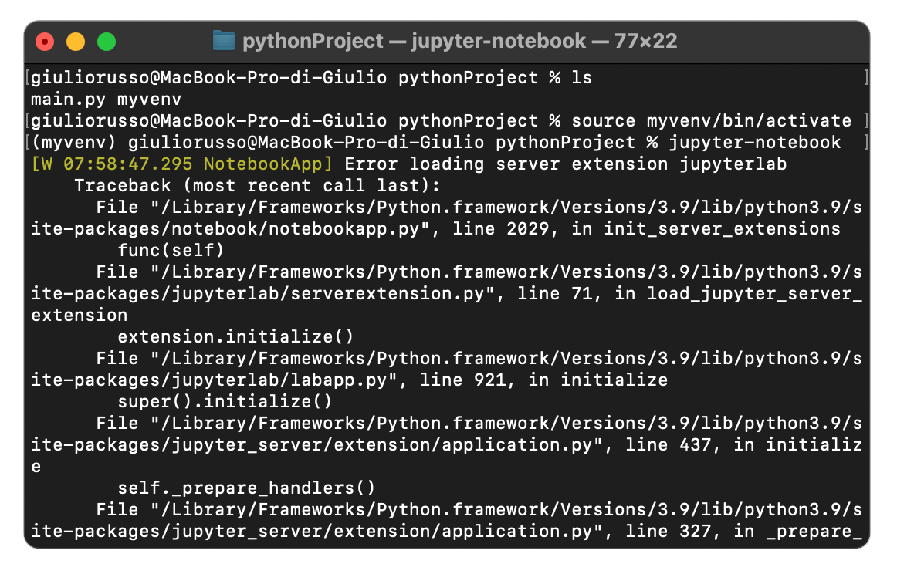 <br>
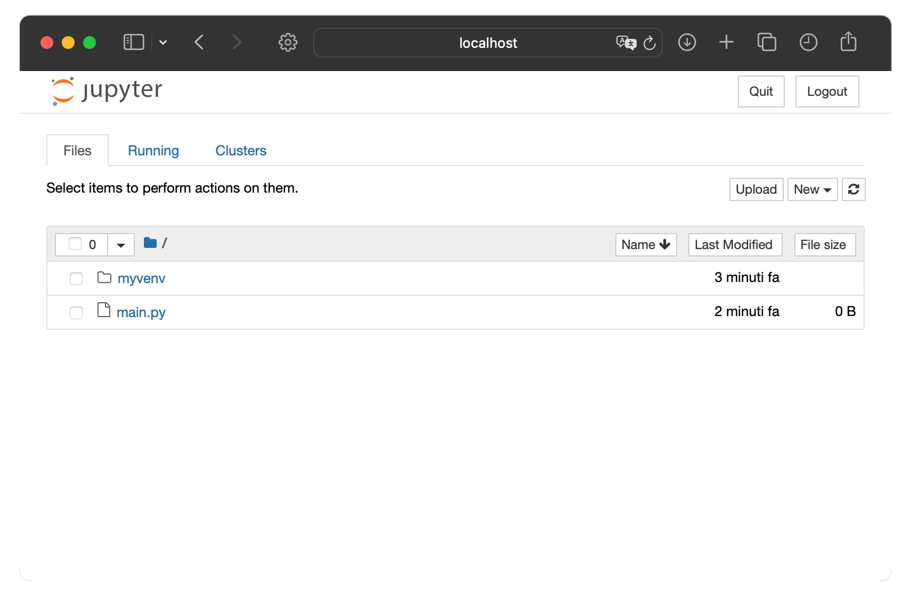

<br>

## 🧬 Kernels: Why the Active Environment Isn't Automatically Used

Launching `jupyter-notebook`/`jupyter-lab` from an activated environment only makes that environment's packages available **if Jupyter itself was installed inside it**. A notebook doesn't run against "whatever env launched the server" — it runs against a **kernel**, a registered pointer to a specific Python interpreter, chosen independently from the **Kernel** menu inside the notebook UI.

To make an environment selectable as a kernel from any Jupyter install:
```bash
source .venv/bin/activate           # or conda activate myenv / uv run —
pip install ipykernel               # (uv: uv add --dev ipykernel)
python -m ipykernel install --user --name .venv --display-name "Python (.venv)"
```
Now "Python (.venv)" appears in the Kernel menu regardless of which environment launched the Jupyter server itself. List/remove registered kernels with:
```bash
jupyter kernelspec list
jupyter kernelspec uninstall <name>
```

<br>

## 📒 Installing JupyterLab
1. Verify your Python and `pip` installation:
   ```bash
   python3 --version
   pip3 --version
   pip3 install --upgrade pip
   ```
2. Install JupyterLab using `pip`:
   ```bash
   pip3 install jupyterlab
   ```
3. To uninstall:
   ```bash
   pip3 uninstall jupyterlab
   ```

<br>

## 🛩️ Running JupyterLab
Launch Jupyter Lab with:
```bash
cd /path/to/your/project
source .venv/bin/activate
jupyter-lab
```
This starts a local web server and opens the Jupyter interface in your default browser, allowing you to create, edit, and run Python files. As above, use the **Kernel** menu to pick the environment you actually want to run against.

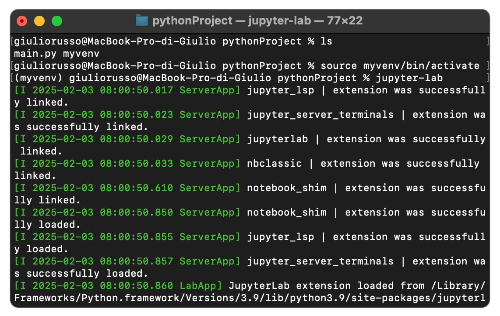
<br>
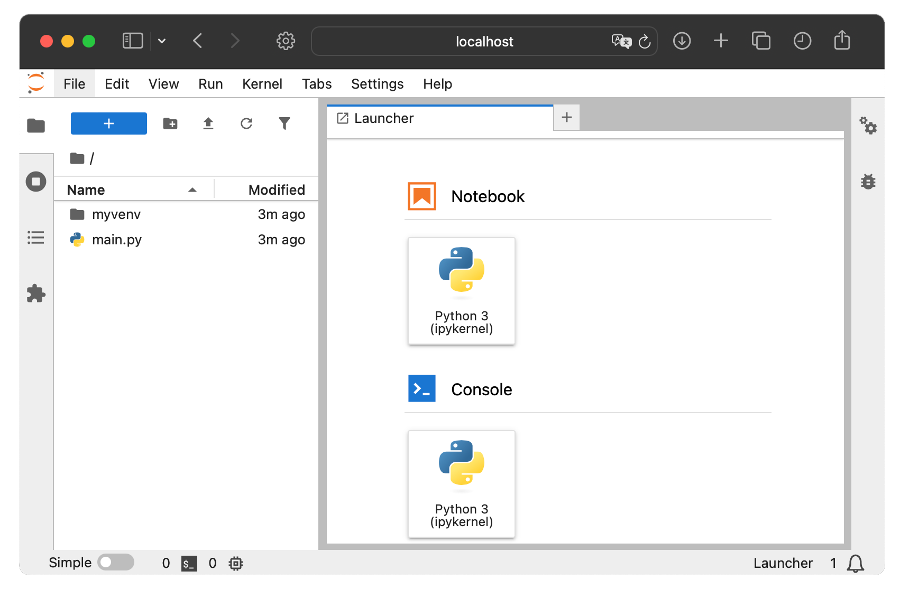

<br>

### Choosing Between Jupyter Notebook and JupyterLab 🔀
- **Jupyter Notebook**: Simple interface for smaller projects and quick prototyping.
- **JupyterLab**: Ideal for larger, more complex workflows requiring multiple tools in one interface.

<br>
<br>
<br>

<center><h1>🌴 Using PyCharm for Python Projects</h1></center>

<br>

## 🔩 PyCharm Install

### for macOS/Windows:
Follow the tutorial: [PyCharm Download](https://www.jetbrains.com/pycharm/download/)

### for Linux:
1. Navigate to the Directory:
   - Ensure you're in the directory where the `.tar.gz` file is located. Use:
     ```bash
     cd /path/to/directory/
     ```
    Replace `/path/to/directory/` with the actual path where your `.tar.gz` files are located. <br>
    [Download PyCharm archive here](https://www.jetbrains.com/help/pycharm/installation-guide.html#standalone)

2. Extract the Tarball:
   - Run the following command to extract the PyCharm tarball to the `/opt` directory:
     ```bash
     sudo tar xzf pycharm-community-<version>.tar.gz -C /opt/
     ```

3. Run PyCharm:
   - Navigate to the extracted folder:
     ```bash
     cd /opt/pycharm-community-<version>/
     ```
   - Launch PyCharm using the following command:
     ```bash
     ./bin/pycharm
     ```
      Note: Launch `pycharm` instead of `pycharm.sh`. More about that [here](https://youtrack.jetbrains.com/articles/SUPPORT-A-56/How-to-handle-Switch-to-a-native-launcher-notification)

<br>


### 🖥️ Create a Desktop Entry for PyCharm on Linux

1. Open a Terminal:
   - Use the following command to open a new `.desktop` file with Nano:
     ```bash
     sudo nano /usr/share/applications/pycharm.desktop
     ```

2. Add the Desktop Entry Content:
   - Paste the following content into the file (adjust the paths as necessary):
     ```plaintext
     [Desktop Entry]
     Name=PyCharm
     Comment=Python IDE
     Exec=/path/to/pycharm/bin/pycharm
     Terminal=false
     Type=Application
     Icon=/path/to/pycharm/bin/pycharm.png
     Categories=Development;IDE;
     ```
     Replace `/path/to/pycharm` with the actual path where PyCharm is installed. <br>
     Note: Connect `pycharm` instead of `pycharm.sh`. More about that [here](https://youtrack.jetbrains.com/articles/SUPPORT-A-56/How-to-handle-Switch-to-a-native-launcher-notification)

3. Save and Exit Nano:
   - Press `Ctrl + O` (Write Out) to save.
   - Press `Enter` to confirm the file name.
   - Press `Ctrl + X` to exit Nano.

4. Verify the Icon:
   - Open your applications menu to ensure the PyCharm icon is visible.

<br>


### 💻 Create a Terminal Shortcut for PyCharm on Linux

1. Open the `bashrc` File:
   - Open a terminal and type the following command to edit your `bashrc` file:
     ```bash
     nano ~/.bashrc
     ```

2. Add the Alias:
   - Scroll to the bottom of the file and add the following line:
     ```bash
     alias pycharm="/path/to/pycharm/bin/pycharm"
     ```
     Replace `/path/to/pycharm` with the actual path where PyCharm is installed on your system. <br>
     Note: Connect `pycharm` instead of `pycharm.sh`. More about that [here](https://youtrack.jetbrains.com/articles/SUPPORT-A-56/How-to-handle-Switch-to-a-native-launcher-notification)

3. Save and Exit Nano:
   - Press `Ctrl + O` to save the changes.
   - Press `Enter` to confirm the file name.
   - Press `Ctrl + X` to exit Nano.

4. Apply the Changes:
   - Reload your `bashrc` file with the following command:
     ```bash
     source ~/.bashrc
     ```

5. Test the Shortcut:
   - In the terminal, type:
     ```bash
     pycharm
     ```
     PyCharm should launch.

<br>


## 1️⃣ Creating a Project with a Virtual Environment
1. Open **PyCharm** and select **New Project**.
2. In the project creation wizard:
   - Under **Location**, specify the project directory.
   - Check **New environment** using **Virtualenv** or **Conda**.
   - Configure the **Base Interpreter** (choose a Python executable).
   - Optionally, check **Inherit global site-packages** to access globally installed packages in the virtual environment.
3. Click **Create**. PyCharm will set up the virtual environment in the project directory (e.g., `my_project/.venv`).

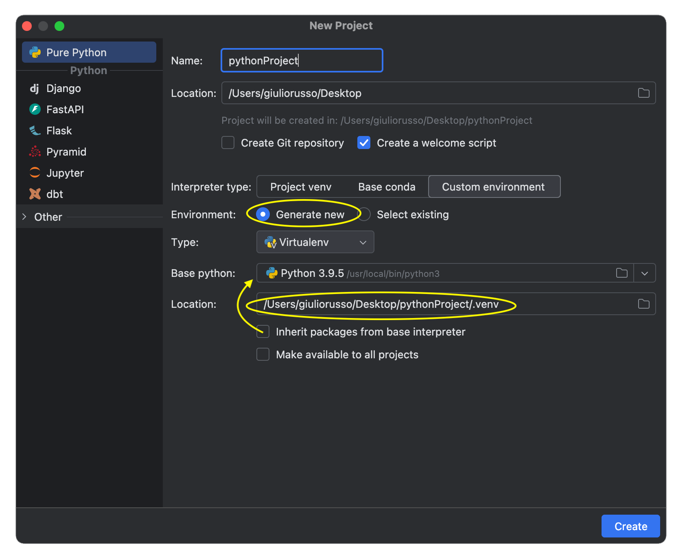
<br>
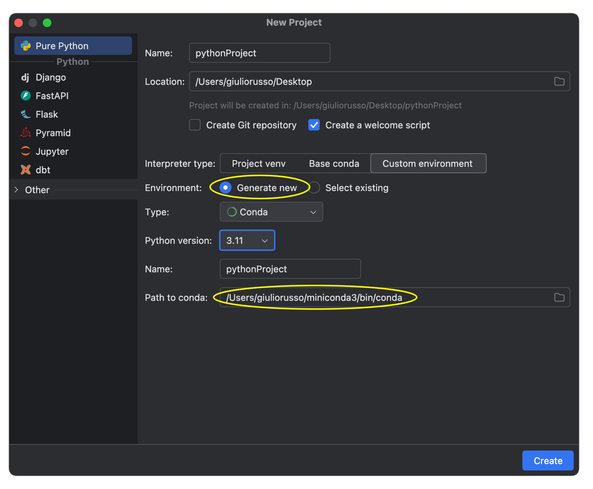

<br>

### Managing Virtual Environment in PyCharm
PyCharm automatically activates the virtual environment in its terminal. To manually activate it in the terminal:
- **macOS/Linux**:
  ```bash
  source /path/to/project/.venv/bin/activate
  ```
- **Windows**:
  ```powershell
  .\path\to\project\.venv\Scripts\Activate.ps1
  ```
Install packages in the activated virtual environment using the **Terminal** tab or **PyCharm's package manager**.

<br>


## 2️⃣ Creating a Project without a Virtual Environment
1. Open **PyCharm** and select **New Project**.
2. In the project creation wizard:
   - Under **Location**, specify the project directory.
   - Check **Previously configured interpreter**.
   - Select a global interpreter from the list (e.g., system Python or Conda).
3. Click **Create**. The project will use the global interpreter.

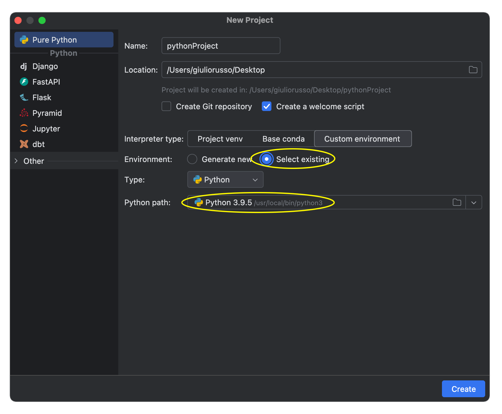
<br>
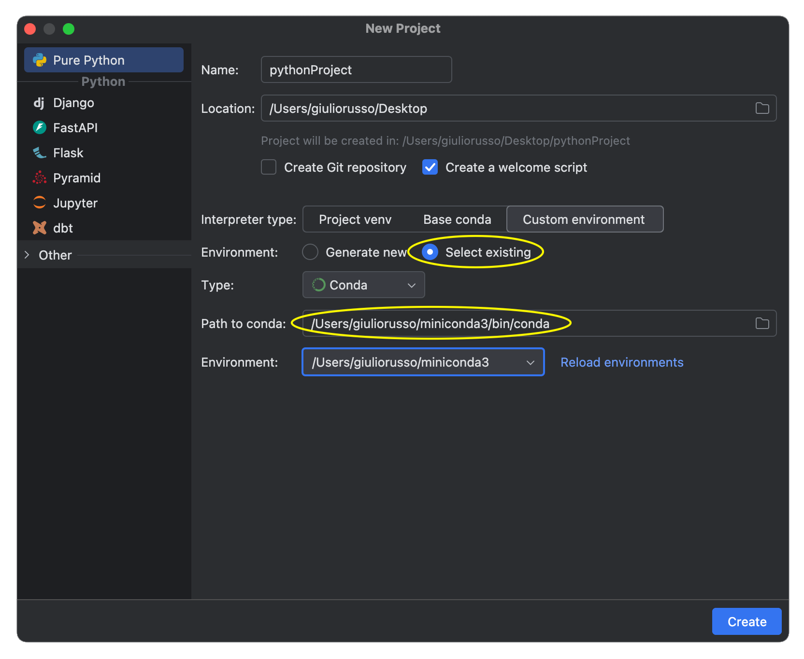


<br>
<br>
<br>

<center><h1>🥏 Using Visual Studio Code for Python Projects</h1></center>

<br>

## 🔩 Visual Studio Code Install

### for macOS/Windows:
Follow the tutorial: [Visual Studio Code Download](https://code.visualstudio.com/download)

### for Linux:
Debian/Ubuntu (recommended — installs via `apt` and stays updated through it):
```bash
sudo apt update
sudo apt install wget gpg
wget -qO- https://packages.microsoft.com/keys/microsoft.asc | gpg --dearmor > packages.microsoft.gpg
sudo install -D -o root -g root -m 644 packages.microsoft.gpg /usr/share/keyrings/packages.microsoft.gpg
sudo sh -c 'echo "deb [arch=amd64,arm64,armhf signed-by=/usr/share/keyrings/packages.microsoft.gpg] https://packages.microsoft.com/repos/code stable main" > /etc/apt/sources.list.d/vscode.list'
sudo apt update
sudo apt install code
```
Fedora/RHEL (`.rpm`-based) — same package repo, or a manual download:
1. Navigate to the directory where the `.rpm` file is located:
     ```bash
     cd /path/to/directory/
     ```
    [Download Visual Studio Code `.rpm` here](https://code.visualstudio.com/Download)
2. Install the `.rpm` Package:
     ```bash
     sudo rpm -ivh code-<version>.rpm
     ```
    Replace `<version>` with the actual version you downloaded.

Verify Installation (any distro):
   ```bash
   code --version
   ```
<br>


## 1️⃣ Creating a Project with a Virtual Environment
1. **Create a Virtual Environment** in your project directory:
   ```bash
   python3 -m venv .venv
   ```
2. In **Visual Studio Code**, open the Command Palette (Ctrl+Shift+P or Cmd+Shift+P).
3. Search for **Python: Select Interpreter**.
4. Select the interpreter for your virtual environment (e.g., `./.venv/bin/python3`) — VS Code auto-detects a `.venv` folder in the project root and lists it at the top.
5. When you open a new terminal in VS Code, activate the virtual environment:
- **macOS/Linux**:
  ```bash
  source .venv/bin/activate
  ```
- **Windows**:
  ```powershell
  .\.venv\Scripts\Activate.ps1
  ```
  Now your code will be executed with the activated environment

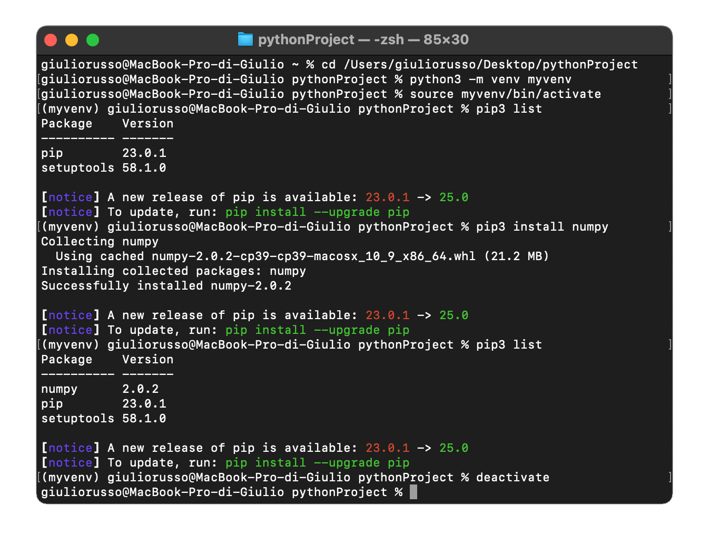
<br>
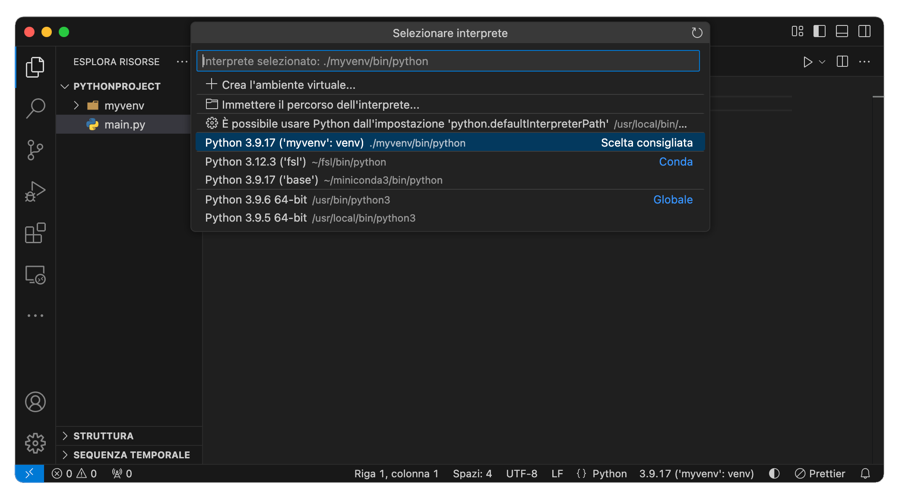

<br>

## 2️⃣ Creating a Project without a Virtual Environment
1. Open a folder in VS Code that contains your project.
2. Select a global interpreter using **Python: Select Interpreter** from the Command Palette.
3. All packages installed will use the global Python installation.

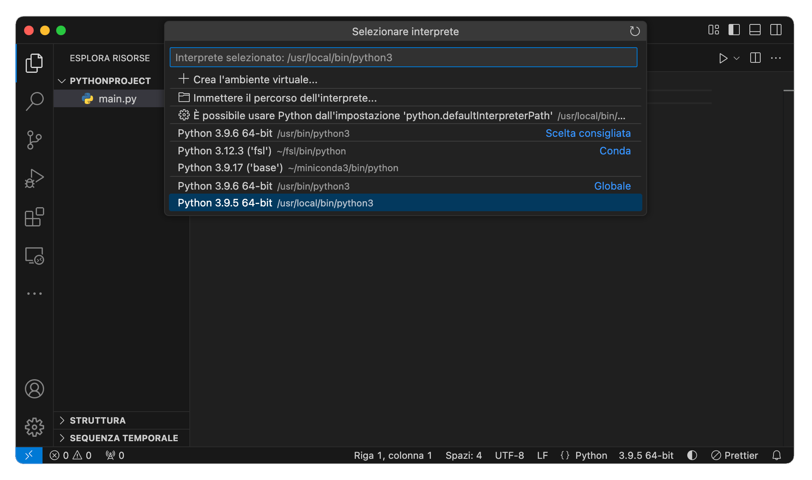

<br>
<br>
<br>

[Back to Index 🗂️](./README.md)
