[Back to Index 🗂️](./README.md)

<center><h1>🐍 What is Python?</h1></center>

Python is a high-level, interpreted programming language widely used in various fields. When working with Python, there are a few key concepts you should understand:

**1. Virtual Environment (venv)**: A virtual environment is an isolated workspace for Python projects. It allows you to manage dependencies for your project without interfering with the global Python installation or other projects.<br>
**2. Interpreter**: The Python interpreter is the program that reads and executes Python code. Depending on your setup, the interpreter could refer to the system Python, a version you installed manually, or one inside a virtual environment.<br>
**3. Script**: A script is a standalone Python file (with a `.py` extension) designed to perform a specific task when executed.<br>

  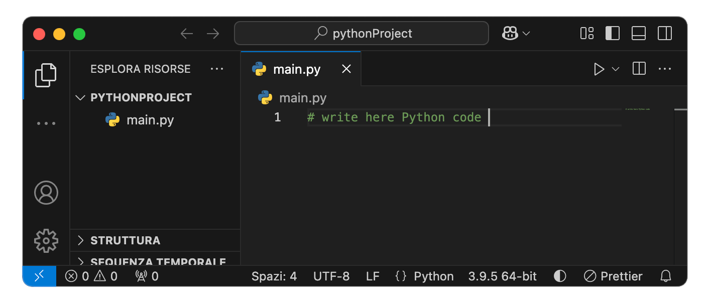

**4. Jupyter Notebook**: A Jupyter Notebook is an interactive web-based Python environment (with a `.ipynb` extension). Jupyter Notebooks are divided into **cells**, which can contain different types of content like Python code, Markdown text, Shell commands etc. Each cell runs independently, but variables persist throughout the notebook session. Cells can be run in any order, but dependencies between them must be managed carefully.<br>

  

**5. Module**: A module is a Python file that contains reusable code, such as functions or classes, which can be imported into other Python files.<br>
**6. Package**: A package is a collection of modules organized into a directory structure.<br>

<br>

## ⌨️ Basic Python Commands

Below is a table summarizing essential Python commands and their differences across macOS, Linux, and Windows:

| **Purpose**                 | **macOS**               | **Linux**               | **Windows**             |
|----------------------------|------------------------|------------------------|------------------------|
| Check installed Python version | `python3 --version` or `python3 -V`   | `python3 --version` or `python3 -V`      | `py --version`          |
| Find the path of the active Python interpreter | `which python3`          | `which python3`          | `where python3`         |
| Locate all paths of Python 3 | `where python3`          | `where python3`          |                        |
| Run a Python script        | `python3 your_script.py` | `python3 your_script.py` | `py your_script.py`     |

<br>

## 🚨 Python3 vs Python2

Python 2 and Python 3 are distinct versions of the Python programming language, with Python 3 being the latest and actively supported version. Here are the key differences and considerations:

- **Python 2:** Use the command `python2` to access Python 2 (if installed).
- **Python 3:** Use the command `python3` to access Python 3.

On modern systems `python` might not be available. To ensure compatibility, always specify `python3` when working with Python 3.

- macOS and Linux systems often include a system-managed version of Python for internal operations (e.g., Python 2.x or 3.x).

To check the version of Python installed:
- For Python 2: `python2 --version`
- For Python 3: `python3 --version`

If you want `python` to refer to Python 3, you can create an alias in your shell configuration file (e.g., `~/.bashrc` or `~/.zshrc`):
```bash
alias python='python3'
```
After adding this, apply the changes by restarting the terminal or running:
```bash
source ~/.zshrc
```
Be cautious with this change, as some older scripts may require `python` to refer to Python 2. Personally, I don't suggest to do that.

<br>
<br>
<br>

<center><h1>🦾 Install Python</h1></center>

It is recommended to avoid using the system Python for development. Instead, install a separate version of Python to avoid conflicts. Python can be installed on macOS, Linux, and Windows using different methods.

<br>

## macOS 🍎

### 1. Using the Official Python Installer
- Visit [python.org/downloads](https://www.python.org/downloads/).
- Download the macOS installer for the desired Python version.
- Follow the installation prompts.
- After installation, verify with:
  ```bash
  python3 --version
  ```

### 2. Using Homebrew
- Ensure Homebrew is installed. If not, install it:
  ```bash
  /bin/bash -c "$(curl -fsSL https://raw.githubusercontent.com/Homebrew/install/HEAD/install.sh)"
  ```
- Install Python:
  ```bash
  brew install python
  ```
- Verify installation:
  ```bash
  python3 --version
  ```

<br>

## Linux 🐧

### 1. Using the Package Manager
- Update the package manager and install Python:
  ```bash
  sudo apt update
  sudo apt install python3
  ```
- Verify installation:
  ```bash
  python3 --version
  ```

### 2. Building from Source
- Download the source code from [python.org](https://www.python.org/).
- Extract the archive and compile Python:
  ```bash
  tar -xvzf Python-<version>.tgz
  cd Python-<version>
  ./configure
  make
  sudo make install
  ```
- Verify installation:
  ```bash
  python3 --version
  ```

<br>

## Windows 🪟

### 1. Using the Official Python Installer
- Visit [python.org/downloads](https://www.python.org/downloads/).
- Download the Windows installer for the desired Python version.
- During installation, select "Add Python to PATH."
- Verify installation:
  ```bash
  py --version
  ```

### 2. Using Microsoft Store
- Open the Microsoft Store and search for "Python."
- Select and install the desired Python version.
- Verify installation:
  ```bash
  py --version
  ```

<br>
<br>
<br>

<center><h1>📦 Installing Python Packages</h1></center>

Python includes `pip`, the default package installer, which simplifies the process of managing additional libraries and dependencies. Typically, `pip` is installed alongside Python, but if it's missing, you can install it manually:

<br>

## ⚙️ Installing `pip`
To install `pip`, download and run the `get-pip.py` script from the official site:
```bash
python3 get-pip.py
```

<br>

## ⌨️ Basic `pip` Commands
Here are some commonly used `pip` commands to manage Python packages:

| **Command**                    | **Purpose**                                      |
|--------------------------------|--------------------------------------------------|
| `pip3 --version` or `pip3 -V`  | Check the installed version of `pip`.            |
| `pip3 list`                    | List all installed Python packages.              |
| `pip3 install <package_name>`  | Install a specific Python package.               |
| `pip3 uninstall <package_name>`| Uninstall a specific Python package.             |
| `pip3 show <package_name>`     | Show detailed information about a package.       |
| `pip3 install --upgrade pip`   | Upgrade `pip` to the latest version.             |
| `which pip3`                   | Locate the `pip3` executable path (macOS/Linux). |
| `where pip3`                   | Locate all paths to `pip3` (Windows).            |

<br>

### Notes
1. Avoid using the system-installed Python for development (macOS and Linux already come with a Python interpreter used by the operating system), as it may conflict with system operations.
2. If managing multiple projects with different package versions, consider using virtual environments to isolate dependencies. When a package is installed, it will be stored along side the Python Interpreter, unless a virtual environment is created and activeted.

<br>
<br>
<br>

<center><h1>❌ Remove Python</h1></center>

<br>

## macOS 🍎:

### 1. via Python Installer
If you installed Python using the Python.org installer, manually remove it:
```bash
sudo rm -rf /Library/Frameworks/Python.framework/Versions/<your_version>
```
Check for symlinks:
```bash
ls -l /usr/local/bin | grep python
```
Remove symlinks:
```bash
sudo rm -f /usr/local/bin/python3.13
sudo rm -f /usr/local/bin/python3
sudo rm -f /usr/local/bin/pip3
```
Verify removal:
```bash
python3 --version
where python3
```

### 2. via Homebrew
List installed Python versions:
```bash
brew list | grep python
```
Uninstall:
```bash
brew uninstall python@<version>
```
Remove remaining symlinks:
```bash
rm -f /usr/local/bin/python3
rm -f /usr/local/bin/pip3
```
Check if installed in `/opt/homebrew/bin`:
```bash
rm -f /opt/homebrew/bin/python3
rm -f /opt/homebrew/bin/pip3
```
Verify:
```bash
brew list | grep python
python3 --version
where python3
```

<br>

## Windows 🪟:

### 1. via Windows Installer
If installed via the Python.org installer:
1. Open **Control Panel ➡️ Programs ➡️ Programs and Features**.
2. Locate **Python X.X**.
3. Click **Uninstall**.

Alternatively, remove it via PowerShell:
```powershell
Get-Package -Name Python* | Uninstall-Package
```
Check Python installation path:
```powershell
where python
```
Manually remove folders (if necessary):
```powershell
Remove-Item -Recurse -Force "C:\Users\<YourUsername>\AppData\Local\Programs\Python"
Remove-Item -Recurse -Force "C:\Program Files\Python*"
```

<br>

## 🐧 Linux

### 1. via Package Manager
For Debian-based systems (Ubuntu, Debian):
```bash
sudo apt-get remove --purge python3.x
sudo apt autoremove
```
For Red Hat-based systems (Fedora, CentOS):
```bash
sudo dnf remove python3.x
```
Check if Python is still installed:
```bash
python3 --version
which python3
```

<br>
<br>
<br>

<center><h1>🔄 Switching Between Installed Python Versions</h1></center>

On **macOS/Linux**, update your shell configuration file:
```bash
export PATH="/usr/local/bin/python3.9:$PATH"
```
Apply changes:
```bash
source ~/.zshrc  # or source ~/.bashrc
```
Verify the change:
```bash
python3 --version
```
On **Windows**, modify the system environment variables:
1. Search **"Environment Variables"**.
2. Edit **PATH** and move the desired Python version to the top.
3. Restart the terminal and check with:
```powershell
python --version
```

<br>
<br>
<br>


<center><h1>🌀 Virtual Environments</h1></center>

Virtual environments allow you to create isolated Python environments for projects, ensuring that dependencies do not conflict with each other or with the system Python installation. This is especially useful when working on multiple projects with different package requirements.

<br>

## ⭐️ Creating a Virtual Environment
1. Navigate to your project directory or specify a desired location:
   ```bash
   python3 -m venv /path/to/project/myvenv
   ```
   For a specific Python version:
   ```bash
   python3.x -m venv /path/to/project/myvenv
   ```

<br>

## 🏁 Activating a Virtual Environment
To use the virtual environment, activate it:
- **macOS/Linux**:
  ```bash
  source /path/to/project/myvenv/bin/activate
  ```
- **Windows**:
  ```bash
  .\path\to\project\myvenv\Scripts\activate
  ```

Once activated, the terminal prompt will change to include the name of the virtual environment (e.g., `(myvenv)`):
```bash
(myvenv) user@machine:~$
```

<br>

## 📦 Installing Packages in a Virtual Environment
With the virtual environment activated, you can use `pip` to install packages. All the packages will be stored inside the active environment and they will not be visible from the other virtual environments:
```bash
pip install <package_name>
```

<br>

## 🛑 Deactivating a Virtual Environment
When you are done working, deactivate the environment:
```bash
deactivate
```
This returns the terminal to the global environment.

<br>

## Why Use Virtual Environments?
1. **Dependency Management**: Avoid conflicts between dependencies required by different projects.
2. **Isolation**: Prevent system-wide changes by containing all packages within the virtual environment.
3. **Reproducibility**: Simplify sharing and collaboration for others to recreate the environment.

By using virtual environments, you maintain clean and organized project setups, reducing the risk of dependency issues.

<br>
<br>
<br>

<center><h1>🐉 Anaconda/Miniconda</h1></center>

Anaconda and Miniconda are powerful tools for managing Python environments and dependencies. They allow the creation of isolated environments for different projects without interfering with your system Python installation.

<br>

## 🔑 Differences Between Anaconda and Miniconda
- **Anaconda**: A larger distribution that includes Python, conda, and many pre-installed data science libraries.
- **Miniconda**: A minimal installation that includes Python and conda, with fewer pre-installed libraries, providing more flexibility.

<br>

## 🔧 Installation Process

### macOS/Linux:
1. Download the installer: Visit [Miniconda](https://docs.conda.io/projects/miniconda/en/latest/) or [Anaconda](https://www.anaconda.com/) and choose the appropriate installer for your system.
2. Alternatively, use the graphical installer (.pkg for macOS).

### Windows:
1. Download the installer from the [official site](https://www.anaconda.com/).
2. Run the installer and follow the instructions.
3. During installation, ensure the option to add conda to the system PATH is selected (optional but useful).

<br>

## 🛜 Installing Miniconda Remotely

1. Create a directory for Miniconda:
   ```bash
   mkdir -p ~/miniconda3
   ```
2. Download and install Miniconda:
   ```bash
   wget https://repo.anaconda.com/miniconda/Miniconda3-latest-Linux-x86_64.sh -O ~/miniconda3/miniconda.sh
   bash ~/miniconda3/miniconda.sh -b -u -p ~/miniconda3
   rm -rf ~/miniconda3/miniconda.sh
   ~/miniconda3/bin/conda init bash
   ~/miniconda3/bin/conda init zsh
   ```

<br>

## ⌨️ Basic Conda Commands

| **Purpose**                              | **Command**                               | **Description**                                                                      |
|---------------------------------------|-------------------------------------------|--------------------------------------------------------------------------------------|
| **Create an environment**             | `conda create --name myvenv python=3.8`    | Creates a new environment named `myvenv` with Python version 3.8.                    |
| **Activate an environment**           | `conda activate myvenv`                    | Activates the environment `myvenv`.                                                  |
| **Deactivate an environment**         | `conda deactivate`                        | Deactivates the currently active environment.                                       |
| **Remove an environment**             | `conda env remove --name myvenv`           | Deletes the environment `myvenv` completely.                                         |
| **Install a package**                 | `conda install <package_name>`            | Installs a specific package into the active environment.                            |
| **Check conda version**               | `conda --version`                         | Displays the currently installed version of conda.                                  |
| **List installed packages**           | `conda list`                              | Lists all packages installed in the active environment.                             |
| **List all environments**             | `conda env list`                          | Displays all available environments and their locations.                            |

<br>

## 🪛 Managing Conda Base Environment

By default, the `base` environment in Conda is activated whenever you open a new terminal.

  ```bash
  (base) user@machine:~$
  ```

Here are commands to manage this behavior:

-  **Prevent Conda Base Activation by Default**: To prevent the `base` environment from being activated automatically:

    ```bash
    conda config --set auto_activate_base false
    ```
    This ensures that Conda doesn’t activate the `base` environment automatically in new terminals.

- **Show or Hide the `(base)` Prefix**: You can customize whether the `(base)` prefix appears in your terminal prompt. To hide the prefix:
    ```bash
    conda config --set changeps1 false
    ```
    To show the prefix:
    ```bash
    conda config --set changeps1 true
    ```

<br>
<br>
<br>

<center><h1>📦 Deploying Python Code</h1></center>
When sharing or deploying Python projects, it is essential to specify dependencies. This ensures that anyone using the code has the correct libraries installed.

<br>

## 📜 `requirements.txt` (For Pip-Based Environments)
A `requirements.txt` file lists the necessary Python packages and their versions. To generate it:
```bash
pip3 freeze > requirements.txt
```
If writing dependencies manually, ensure you:
- Specify **package names and versions** to avoid compatibility issues.
- Keep each dependency on a **new line**.
- Use version constraints (`==`, `>=`, `<=`) to define exact or flexible versions:
  ```
  numpy>=1.21.0  # Any version 1.21 or later
  scipy<=1.5.4   # Up to version 1.5.4
  ````

To install dependencies from a `requirements.txt` file:
```bash
pip3 install -r requirements.txt
```

<br>

Example `requirements.txt`:
```
numpy==1.21.0
pandas==1.3.0
matplotlib
```

<br>

## 🛠️ `.yaml` (For Conda-Based Environments)
A `.yaml` file is used to define dependencies in **Conda environments**. To generate it:
```bash
conda env export > environment.yaml
```
To recreate an environment from a `.yaml` file:
```bash
conda env create -f environment.yaml
```

<br>

Example `environment.yaml`:
```yaml
name: my_env
channels:
  - defaults
  - conda-forge
dependencies:
  - python=3.8
  - numpy
  - pandas
  - matplotlib
```

<br>
<br>
<br>

<center><h1>📓 Jupyter Notebooks and JupyterLab 🧪</h1></center>

Jupyter Notebooks and JupyterLab are popular tools for interactive programming in Python, especially for data analysis, visualization, and exploration.

<br>

## 📙 Installing Jupyter Notebook
1. Verify your Python and `pip` installation:
   ```bash
   python3 --version
   pip3 --version
   pip3 install --upgrade pip
   ```
2. Install Jupyter Notebook:
   ```bash
   pip3 install notebook
   ```
3. To uninstall:
   ```bash
   pip3 uninstall notebook
   ```

<br>

## 🏎️ Running Jupyter Notebook
Launch Jupyter Notebook with:
```bash
cd /path/to/your/project
source myvenv/bin/activate
jupyter-notebook
```
This starts a local web server and opens the Jupyter interface in your default browser, allowing you to create, edit, and run Python files. The active environment when Jupyter Lab is launched will be the environment active into your project.

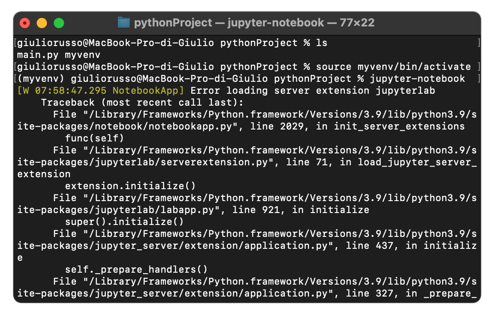 <br>
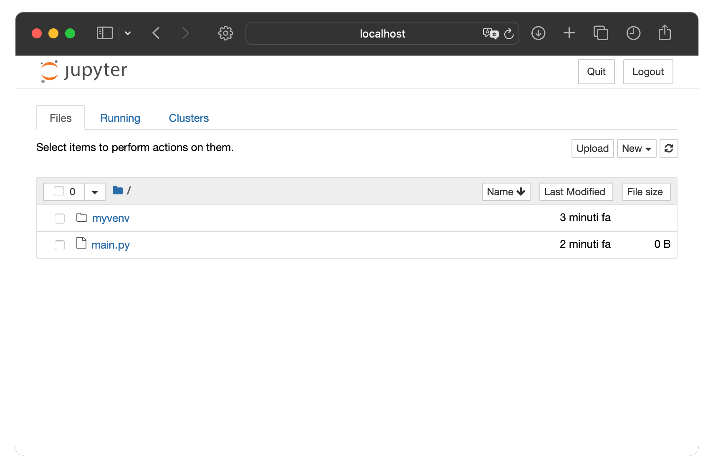

<br>

## 📒 Installing JupyterLab
1. Verify your Python and `pip` installation:
   ```bash
   python3 --version
   pip3 --version
   pip3 install --upgrade pip
   ```
2. Install JupyterLab using `pip`:
   ```bash
   pip3 install jupyterlab
   ```
3. To uninstall:
   ```bash
   pip3 uninstall jupyterlab
   ```

<br>

## 🛩️ Running JupyterLab
Launch Jupyter Lab with:
```bash
cd /path/to/your/project
source myvenv/bin/activate
jupyter-lab
```
This starts a local web server and opens the Jupyter interface in your default browser, allowing you to create, edit, and run Python files. The active environment when Jupyter Lab is launched will be the environment active into your project.

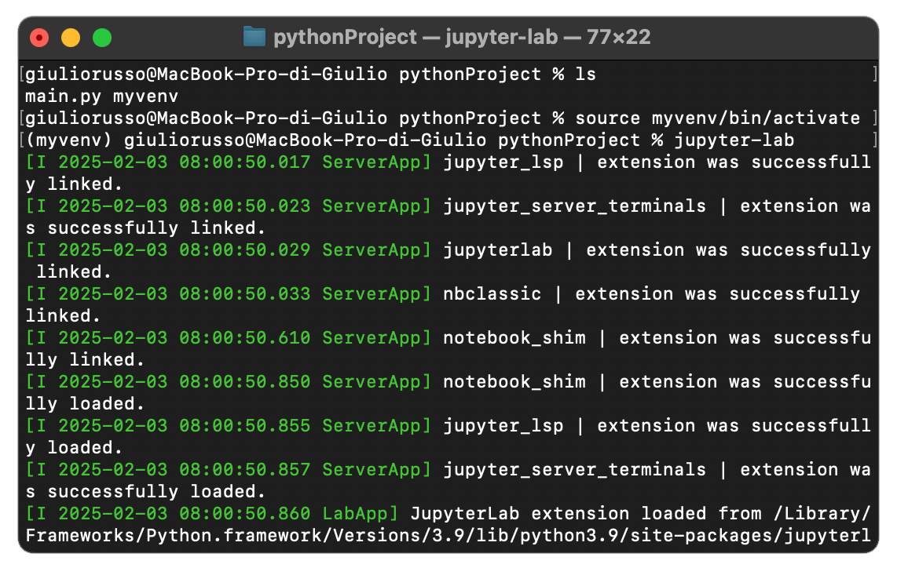
<br>
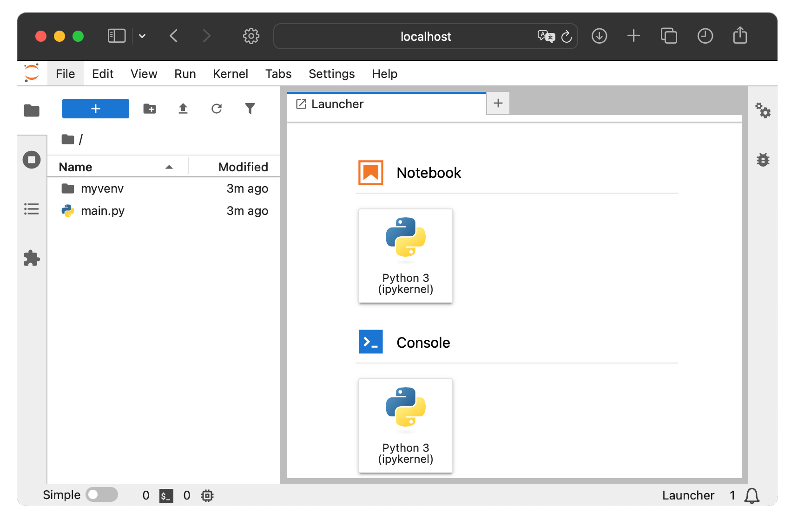

<br>

### Choosing Between Jupyter Notebook and JupyterLab 🔀
- **Jupyter Notebook**: Simple interface for smaller projects and quick prototyping.
- **JupyterLab**: Ideal for larger, more complex workflows requiring multiple tools in one interface.

<br>
<br>
<br>

<center><h1>🌴 Using PyCharm for Python Projects</h1></center>

[PyCharm Download](https://www.jetbrains.com/pycharm/download/)

<br>

## 1️⃣ Creating a Project with a Virtual Environment
1. Open **PyCharm** and select **New Project**.
2. In the project creation wizard:
   - Under **Location**, specify the project directory.
   - Check **New environment** using **Virtualenv** or **Conda**.
   - Configure the **Base Interpreter** (choose a Python executable).
   - Optionally, check **Inherit global site-packages** to access globally installed packages in the virtual environment.
3. Click **Create**. PyCharm will set up the virtual environment in the project directory (e.g., `my_project/venv`).

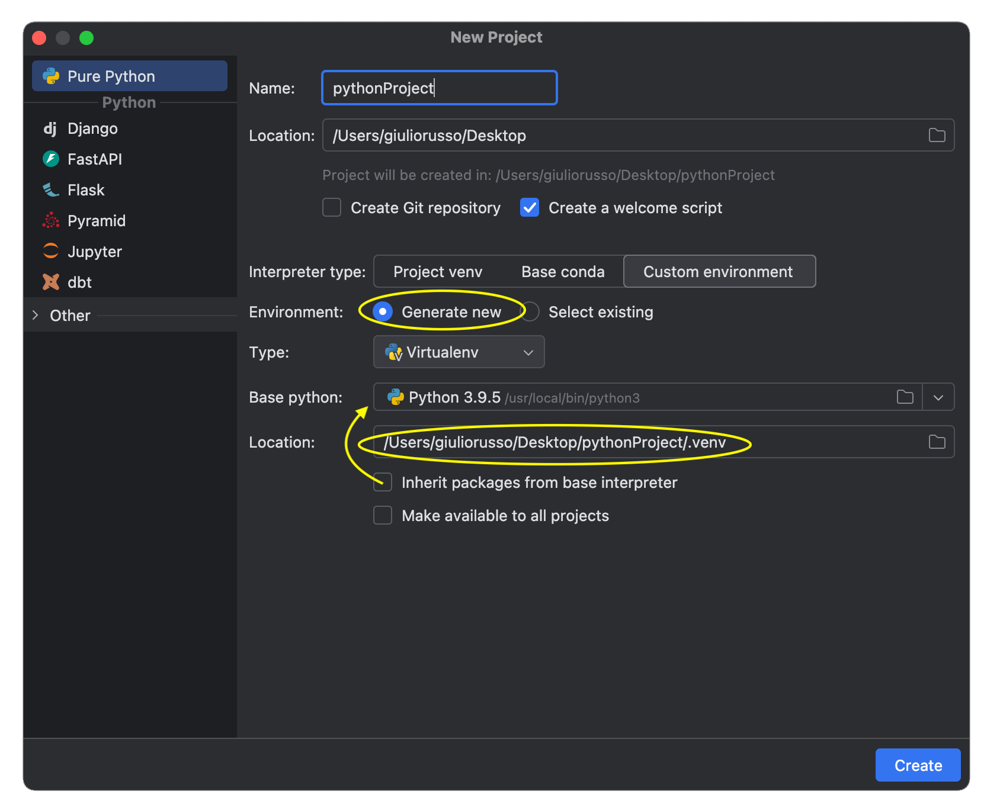
<br>


<br>

### Managing Virtual Environment in PyCharm
PyCharm automatically activates the virtual environment in its terminal. To manually activate it in the terminal:
- **macOS/Linux**:
  ```bash
  source /path/to/project/venv/bin/activate
  ```
- **Windows**:
  ```bash
  .\path\to\project\venv\Scripts\activate
  ```
Install packages in the activated virtual environment using the **Terminal** tab or **PyCharm's package manager**.

<br>


## 2️⃣ Creating a Project without a Virtual Environment
1. Open **PyCharm** and select **New Project**.
2. In the project creation wizard:
   - Under **Location**, specify the project directory.
   - Check **Previously configured interpreter**.
   - Select a global interpreter from the list (e.g., system Python or Conda).
3. Click **Create**. The project will use the global interpreter.

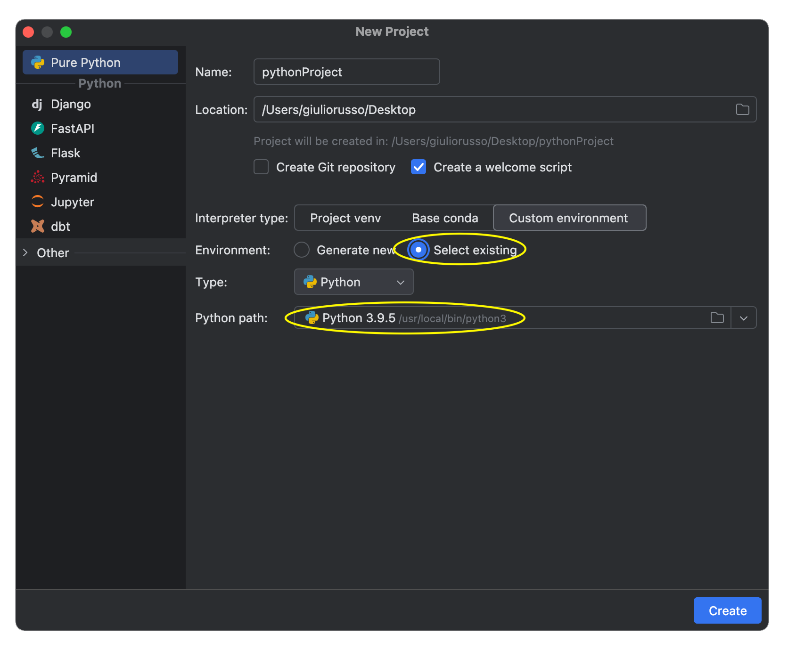
<br>
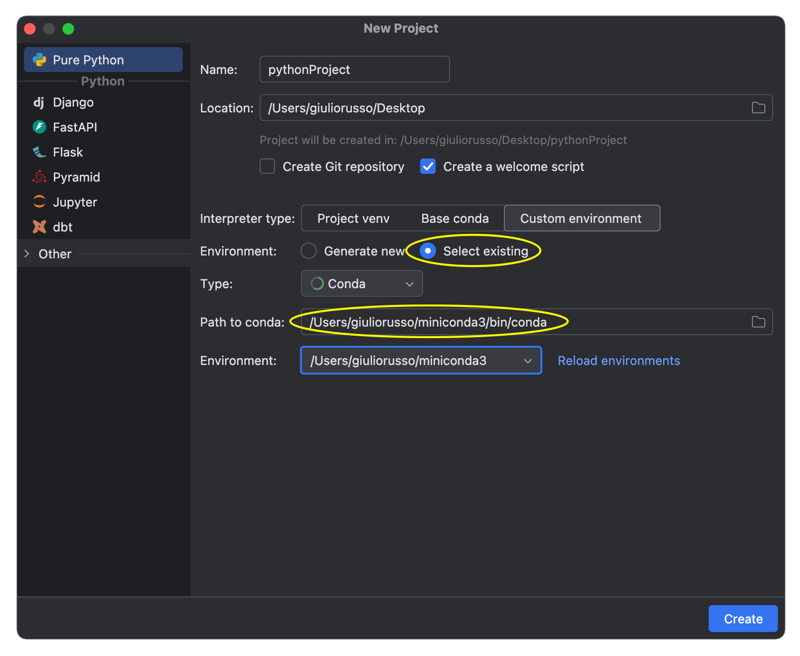


<br>
<br>
<br>

<center><h1>🥏 Using Visual Studio Code for Python Projects</h1></center>

[Visual Studio Code Download](https://code.visualstudio.com/download)

<br>

## 1️⃣ Creating a Project with a Virtual Environment
1. **Create a Virtual Environment** in your project directory:
   ```bash
   python3 -m venv myvenv
   ```
2. In **Visual Studio Code**, open the Command Palette (Ctrl+Shift+P or Cmd+Shift+P).
3. Search for **Python: Select Interpreter**.
4. Select the interpreter for your virtual environment (e.g., `/myvenv/bin/python3`).
5. When you open a new terminal in VS Code, activate the virtual environment:
- **macOS/Linux**:
  ```bash
  source myvenv/bin/activate
  ```
- **Windows**:
  ```bash
  .\myvenv\Scripts\activate
  ```
  Now your code will be executed with the activated environment

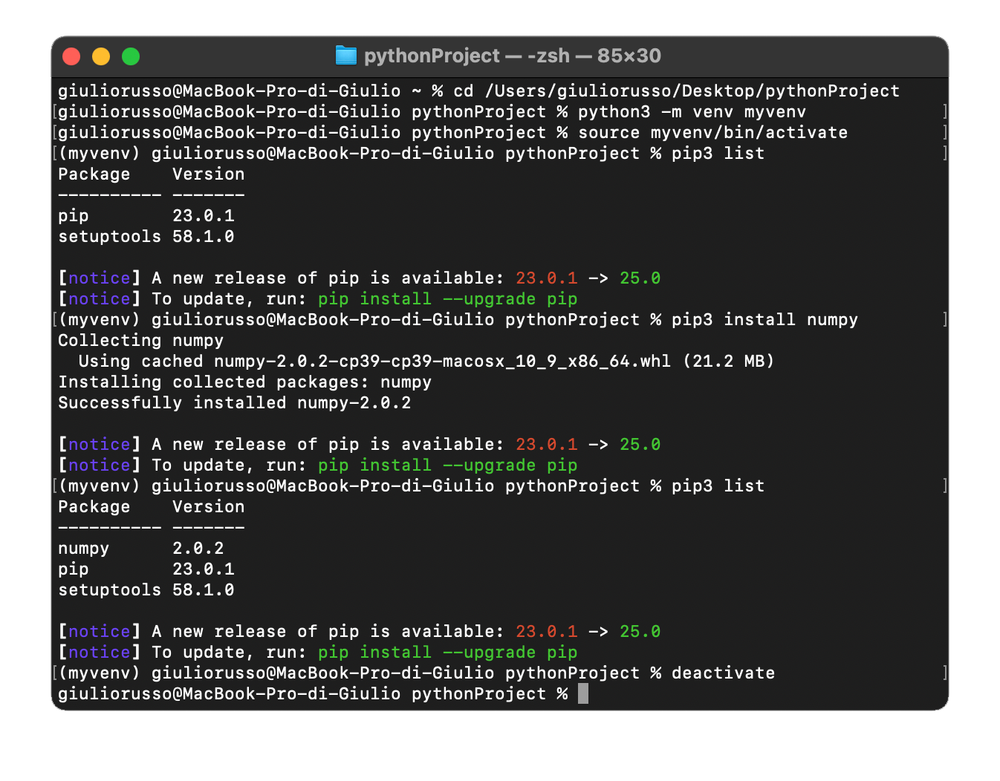
<br>
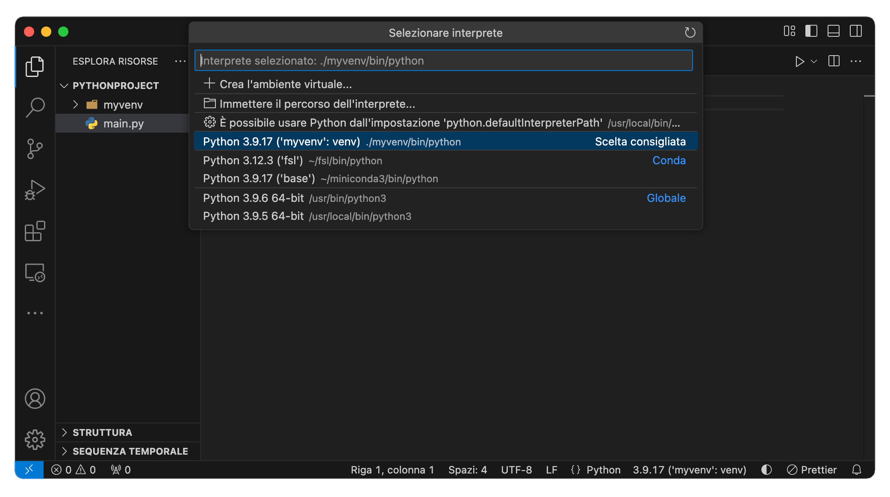

<br>

## 2️⃣ Creating a Project without a Virtual Environment
1. Open a folder in VS Code that contains your project.
2. Select a global interpreter using **Python: Select Interpreter** from the Command Palette.
3. All packages installed will use the global Python installation.

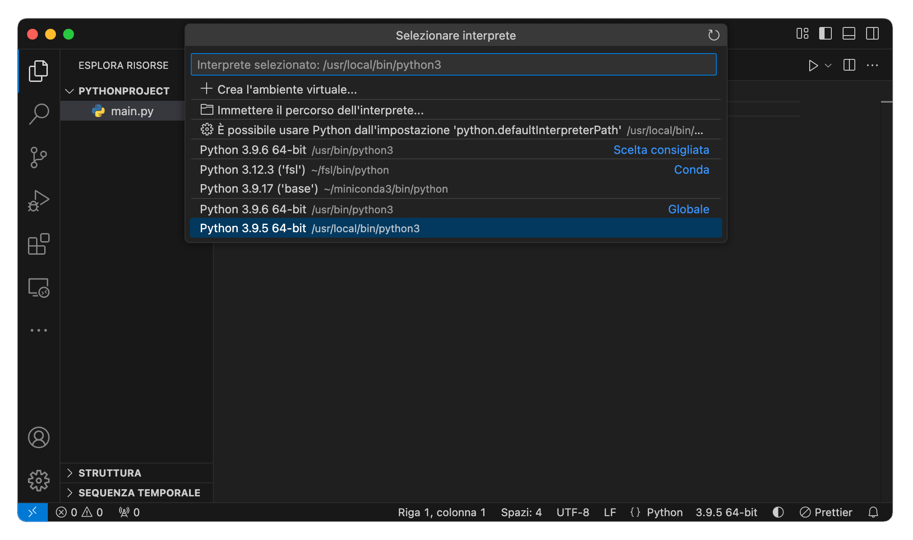


<br>
<br>
<br>

[Back to Index 🗂️](./README.md)