[Back to Index 🗂️](./README.md)

<center><h1>🛜 SSH Guide</h1></center>

SSH (Secure Shell) is a protocol that allows you to connect to another computer (typically a server) over the network. For example, it’s often used to access remote servers with GPUs to run deep learning experiments.

<br>

## 🔮 Connecting to a Server 

To connect, you need:

1. The server address.
2. Your username on the server.

<br>

**Command Structure**
```bash
ssh username@server -p PORT
```

- `username`: Your account name on the remote server.
- `server`: The remote device's IP address or alias.
- `PORT`: The port used for the connection.

**Steps:**

1. Run the command above.
2. Enter your password when prompted.

<br>

## *️⃣ Using SSH Keys to Avoid Passwords 

SSH keys allow password-less login and are recommended for secure connections. Below are the steps for generating and using SSH keys across macOS, Linux, and Windows.

### macOS/Linux 💻:

1. Open a terminal.
2. Navigate to the hidden `.ssh/` directory (e.g., `/Users/username/.ssh` on macOS or `/home/username/.ssh` on Linux).
3. Generate a new SSH key pair:

   ```bash
   ssh-keygen -t rsa -b 4096 -C "your_email@example.com"
   ```
   - Follow the prompts to save the key (default location is `~/.ssh/id_rsa`) and optionally add a passphrase for extra security.
4. Add the public key to the server:
   ```bash
   ssh-copy-id username@server
   ```
   If `ssh-copy-id` is unavailable, copy the public key manually:
   ```bash
   cat ~/.ssh/id_rsa.pub | ssh username@server "mkdir -p ~/.ssh && cat >> ~/.ssh/authorized_keys"
   ```
5. Test the connection:
   ```bash
   ssh username@server
   ```

### Windows 🖥️:

1. Install [Git for Windows](https://git-scm.com/) or [OpenSSH](https://docs.microsoft.com/en-us/windows-server/administration/openssh/openssh_install_firstuse) to use SSH.
2. Open PowerShell or Git Bash.
3. Generate a new SSH key pair:

   ```bash
   ssh-keygen -t rsa -b 4096 -C "your_email@example.com"
   ```
4. Copy the public key to the server. If `ssh-copy-id` is unavailable, copy it manually:
   ```bash
   type $HOME\.ssh\id_rsa.pub | ssh username@server "mkdir -p ~/.ssh && cat >> ~/.ssh/authorized_keys"
   ```
5. Test the connection:
   ```bash
   ssh username@server
   ```

Now, you can log in without entering a password on all platforms.

<br>

## 🔌 Disconnecting 

To disconnect from the server:

- Type `exit`, or
- Use the shortcut `Ctrl + D`.

<br>
<br>
<br>

<center><h1>🦆 Cyberduck</h1></center>

Cyberduck simplifies remote file management without using Linux commands.

<br>

## 💡 Steps to Connect 

1. Open Cyberduck and click the `+` button at the bottom left.
2. Select **SFTP (SSH)** for file transfer.
3. Fill in the required fields:
   - **Nickname**
   - **Server**
   - **Port**
   - **Username**
   - **Password** (or **SSH private key** if using key authentication).
4. Save the connection.

   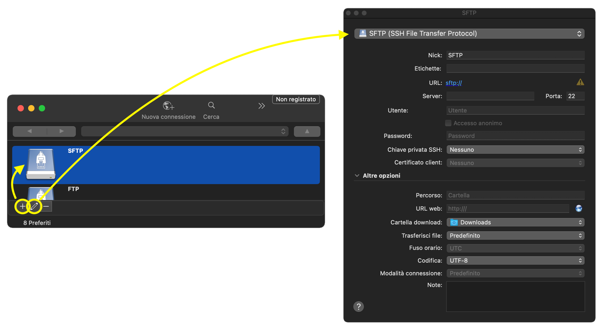

Note: Use `Command + R` to refresh files when changes are not immediately visible.

<br>
<br>
<br>

<center><h1>🐍 PyCharm</h1></center>

## 1️⃣ Setting Up a Remote Interpreter

1. Open **Preferences** inside the PyCharm to connect with a Remote Interpreter.

   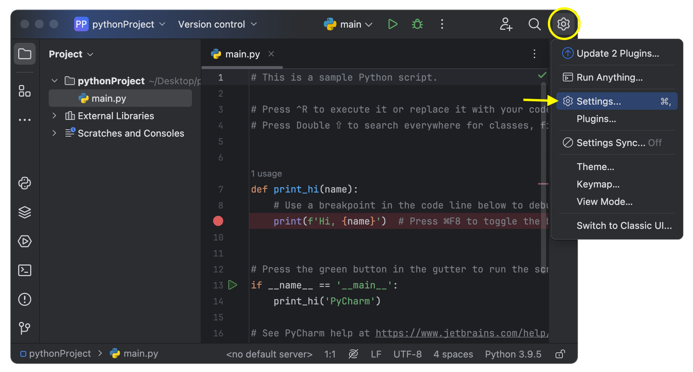

2. Go to **Python Interpreter** ➡️ **Add Interpreter** ➡️ **On SSH**.

   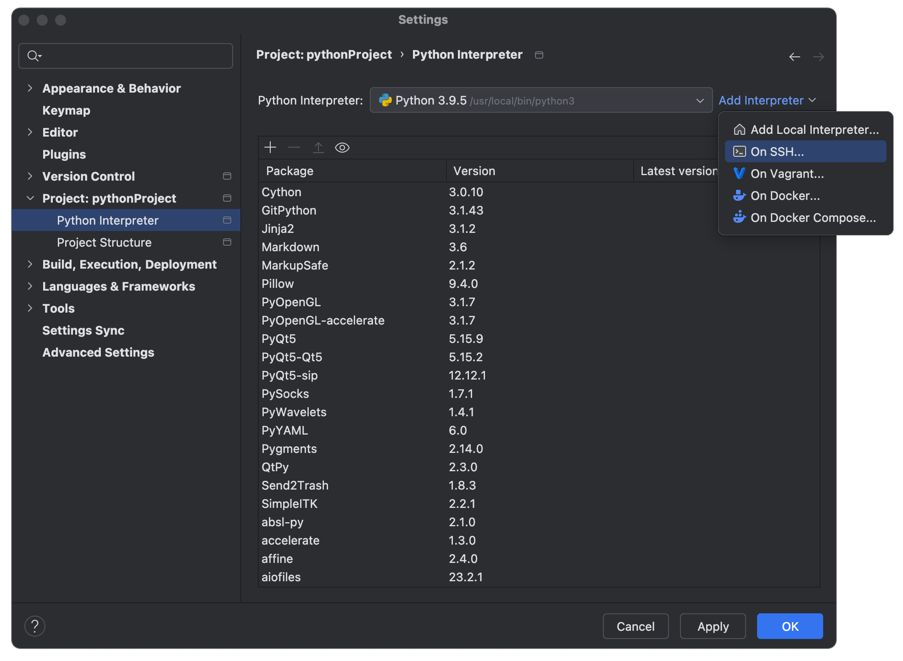

3. Enter the required details:
   - **Host** (server IP address or alias).
   - **Port Number**.
   - **Username**.

   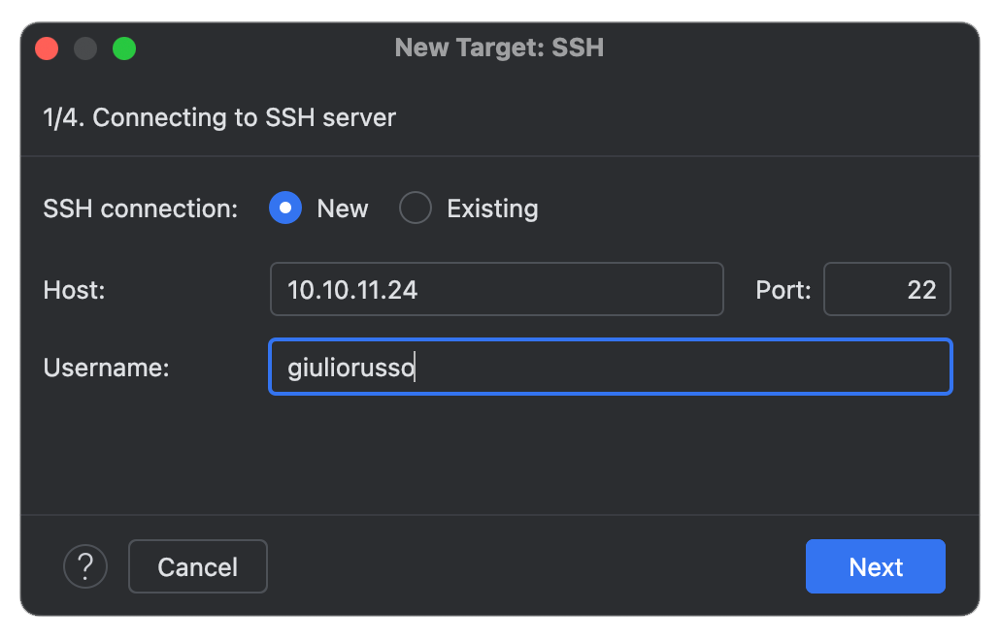

4. Follow the steps to verify authentication.

   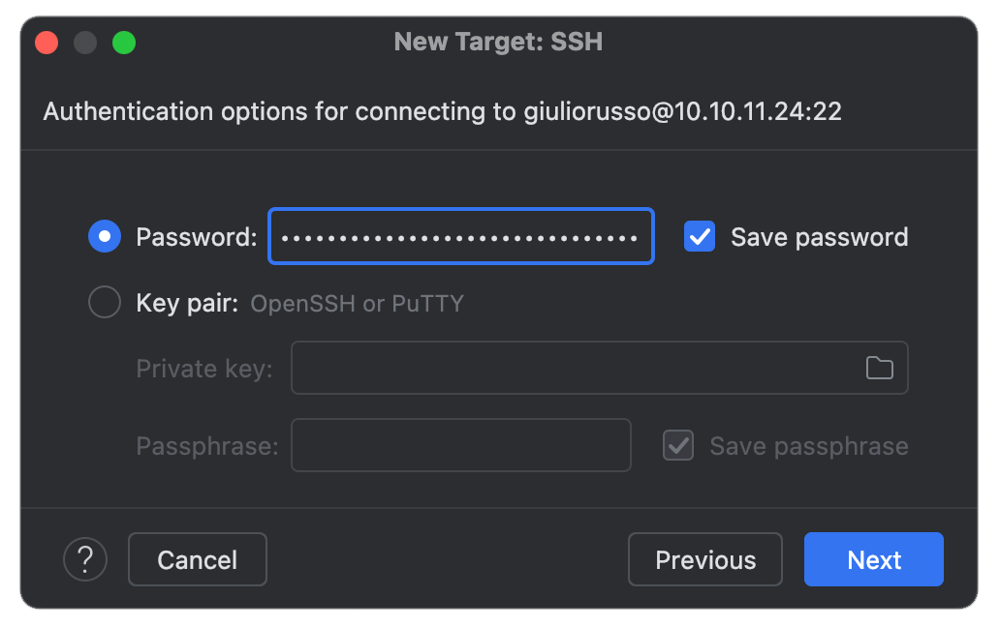
   <br>
   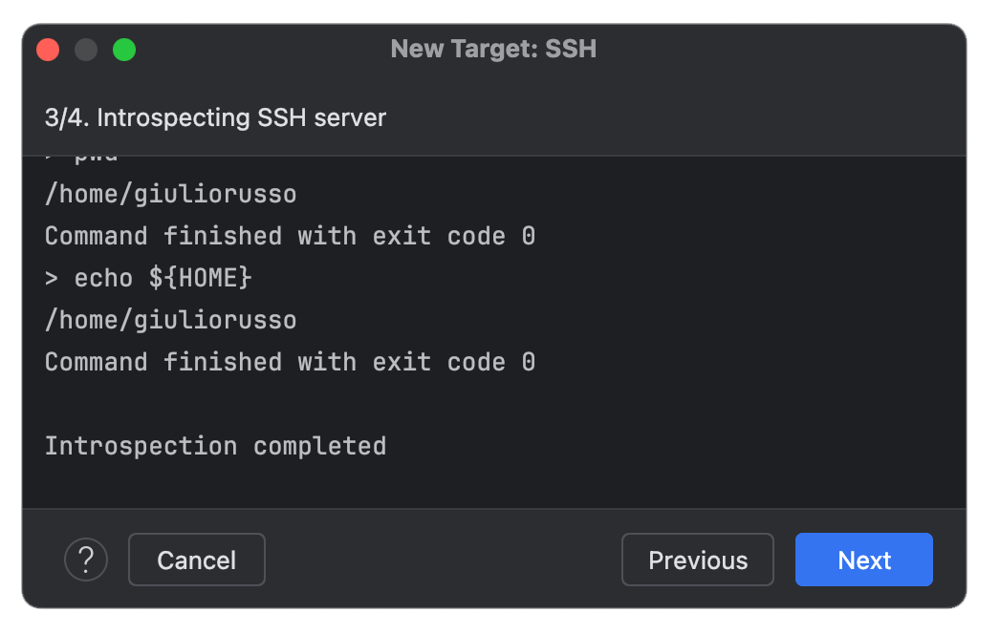

Select the appropriate Python environment or System interpreter path on the Server:
- **Virtual Environment**: if you have a specific virtual environment for your project, select the path of its python3 on the Server (e.g., `/home/user/pythonProject/myvenv/bin/python3` or if you use miniconda `/home/user/miniconda3/envs/myvenv/bin/python3`)
- **System Interpreter**: if you use a global interpreter without a specific virtual environment, select the path of its python3 on the Server (e.g., `/usr/bin/python3` or if you use the miniconda base interpreter `/home/user/miniconda3/bin/python3`)

<br>

   In case you use a specific virtual environment, specify the path to the interpeter of the specific environment: <br>
   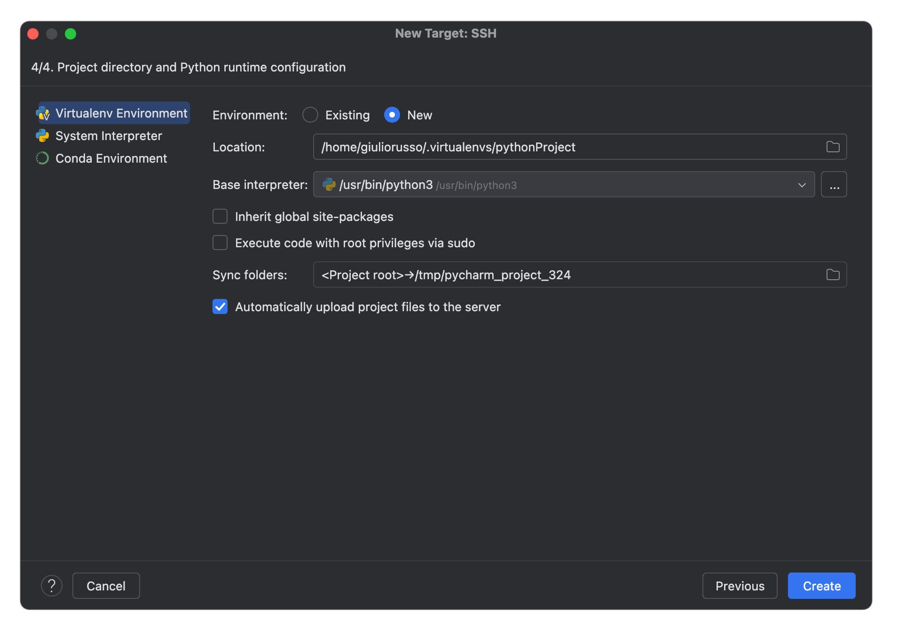

   In case you use a global interpreter, specify the path to the global Python interpreter: <br>
   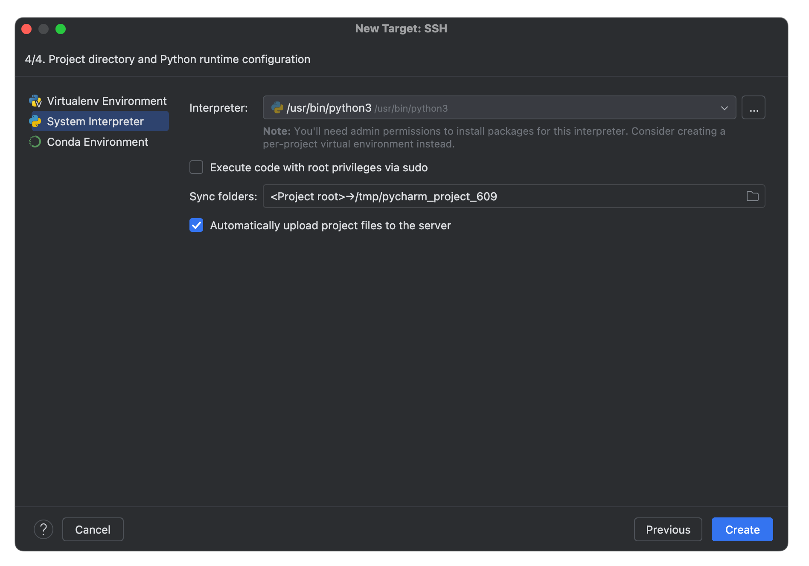

   In case you use Conda, specify the path to the base environment interpreter, or any other interpreter of a specific virtual environment: <br>
   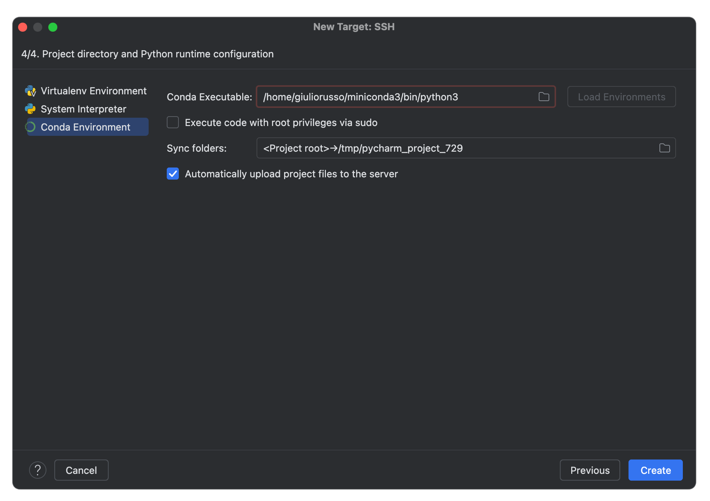

<br>

## 2️⃣ Deployment on Remote Server

To upload files to a remote server:

1. Open **Preferences** ➡️ **Deployment**. <br>

<br>
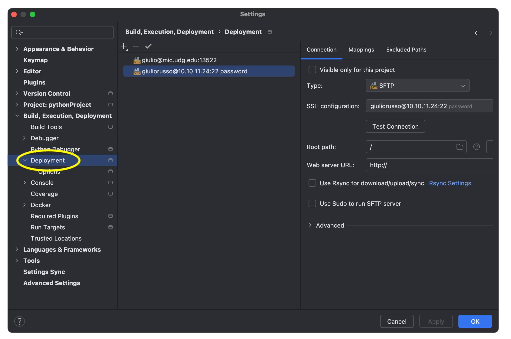

2. Add a new server configuration.

   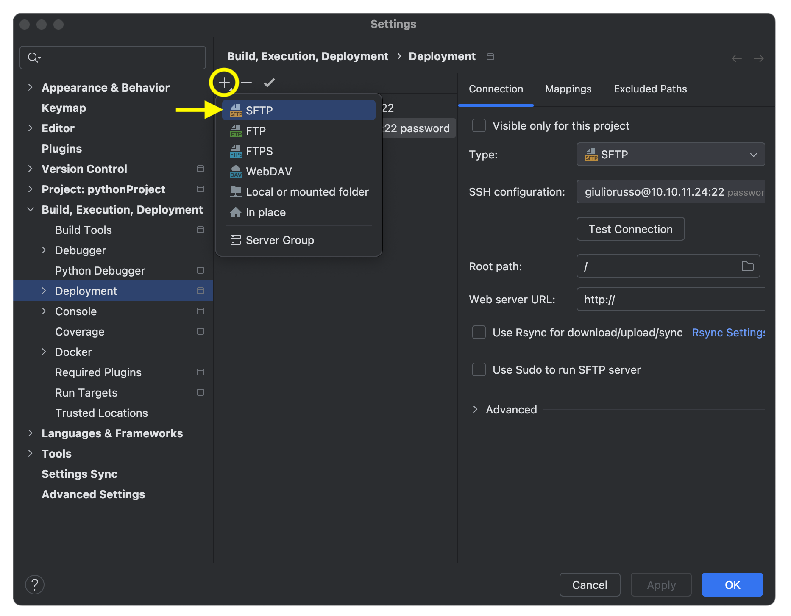
   <br>
      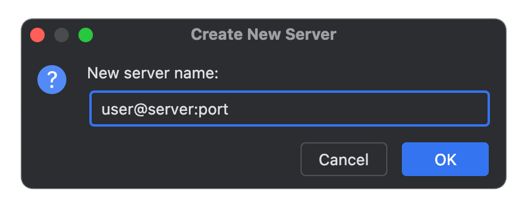

3. Map the local project path to the remote server's directory at `Deployment path`.

      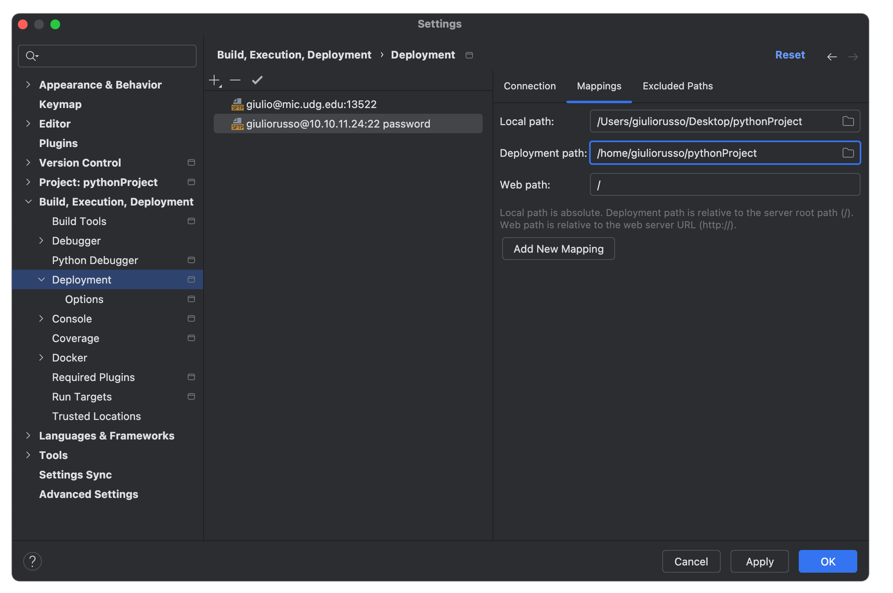


   Files and Folders can be uploaded with right-click on the target content and click on `Upload to <your_server>`

   Also, you can select the option `Automatic Upload` in `Tools` that will load every modification directly on the Server.

<br>

### 🚨 Pay Attention

If a content is uploaded to the Server, but deleted on your local project, this will NOT be deleted also on the Server. In this case you will need to delete the content also on the Server.

<br>
<br>
<br>

<center><h1>🥏 Visual Studio Code Remote</h1></center>

<br>

1. Install the **Remote SSH** extension.

2. Configure SSH in the hidden file `~/.ssh/config`:
   ```ssh
   Host <server>
       HostName <server>
       User <username>
       Port <port>
   ```

3. Connect via the Remote SSH icon in VS Code.

   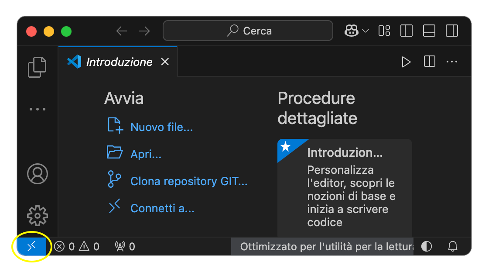

   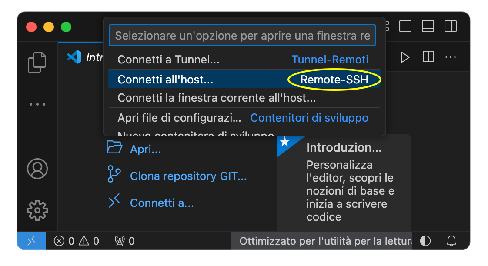

   All the configured remote connections will be visualized here:

   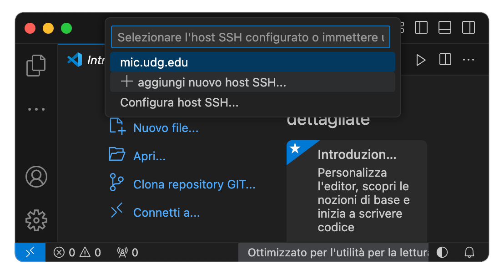

<br>
<br>
<br>

<center><h1>📟 Background Sessions</h1></center>

<br>

## ⚒️ Using `tmux` for Persistent Sessions

- Start a session: `tmux new -s <name>`
- List sessions: `tmux ls`
- Reattach to a session: `tmux a -t <name>`
- Detach from a session: `Ctrl + b + d`
- Kill a session: `tmux kill-session -t <name>`

<br>

## 🛠️ Using `nohup` for Background Processes

Run even after disconnecting and redirecting the output:

- **Python Script**:
   ```bash
   nohup python3 -u script.py > output.log &
   ```

- **Bash Script**:
   ```bash
   nohup sh ./script.sh > output.log &
   ```

<br>
<br>
<br>

[Back to Index 🗂️](./README.md)