[Back to Index 🗂️](./README.md)

<center><h1>🛜 SSH Guide</h1></center>

SSH (Secure Shell) is a protocol that allows you to connect to another computer (typically a server) over the network. For example, it's often used to access remote servers with GPUs to run deep learning experiments.

<br>

## 🔮 Connecting to a Server

To connect, you need:

1. The server address.
2. Your username on the server.

<br>

**Command Structure**
```bash
ssh username@server -p PORT
```

- `username`: Your account name on the remote server.
- `server`: The remote device's IP address or alias.
- `PORT`: The port used for the connection (omit `-p PORT` to use the default, `22`).

**Steps:**

1. Run the command above.
2. On the very first connection, SSH shows the server's key fingerprint and asks you to confirm it — this is expected (Trust On First Use); it lets you detect if a connection is later silently redirected to a different machine.
3. Enter your password when prompted.

<br>

## 🗂️ SSH Config — Stop Repeating Yourself

Retyping `username@server -p PORT` (and later, the same three fields again in every IDE) gets old fast. Define an alias once in `~/.ssh/config` (create the file if it doesn't exist):

```ssh
Host myserver
    HostName 192.168.1.10
    User username
    Port 2222
```

- `Host`: the short alias **you** choose — this is what you'll type.
- `HostName`: the server's real address (IP or domain) — only needed here, nowhere else.
- `User` / `Port`: same fields as before, just stated once.

From now on:
```bash
ssh myserver
```
connects with all three fields filled in automatically — and PyCharm, VS Code, Cyberduck, and any other SSH-aware tool can also use `myserver` directly once this file exists.

<br>

## *️⃣ Using SSH Keys to Avoid Passwords

SSH keys allow password-less login and are recommended for secure connections.

### Generate a key pair (macOS/Linux, and Windows via Git Bash)

```bash
ssh-keygen -t ed25519 -C "your_email@example.com"
```
Follow the prompts to save the key (default location `~/.ssh/id_ed25519`) and optionally add a passphrase for extra security. `ssh-keygen` creates `~/.ssh/` for you if it doesn't exist yet — no need to `cd` there first.

> Use `ssh-keygen -t rsa -b 4096 -C "your_email@example.com"` instead only if the target server is old enough to not support `ed25519` (rare today).

### Fix permissions

SSH silently refuses (or loudly warns about) keys that are readable by anyone but you:
```bash
chmod 700 ~/.ssh
chmod 600 ~/.ssh/id_ed25519       # private key — never share this file
chmod 644 ~/.ssh/id_ed25519.pub   # public key — safe to share/copy to servers
```

### Copy the public key to the server

```bash
ssh-copy-id myserver
```
If `ssh-copy-id` is unavailable (default on native Windows OpenSSH, not Git Bash), copy it manually and fix the remote permissions the same way:
```bash
cat ~/.ssh/id_ed25519.pub | ssh myserver "mkdir -p ~/.ssh && chmod 700 ~/.ssh && cat >> ~/.ssh/authorized_keys && chmod 600 ~/.ssh/authorized_keys"
```

### Test it

```bash
ssh myserver
```
You should log in without a password prompt (or, if you set a passphrase, it now asks for the passphrase instead — see below).

### Windows without Git Bash

Windows 10/11 ships an OpenSSH client built-in — `ssh`/`ssh-keygen` work out of the box in PowerShell, no install needed. `ssh-copy-id` isn't included, so use the manual-copy method above, replacing `cat` with PowerShell's equivalent:
```powershell
Get-Content $HOME\.ssh\id_ed25519.pub | ssh myserver "mkdir -p ~/.ssh && chmod 700 ~/.ssh && cat >> ~/.ssh/authorized_keys && chmod 600 ~/.ssh/authorized_keys"
```
(Installing [Git for Windows](https://git-scm.com/) gets you Git Bash, where every macOS/Linux command above works unmodified — simplest option if you're doing this often.)

### Not being asked for the passphrase every time

If you protected your key with a passphrase, `ssh-agent` caches it in memory for the session so you're not retyping it on every connection:
```bash
eval "$(ssh-agent -s)"
ssh-add ~/.ssh/id_ed25519
```

<br>

## 🔌 Disconnecting

To disconnect from the server:

- Type `exit`, or
- Use the shortcut `Ctrl + D`.

<br>
<br>
<br>

<center><h1>🦆 Cyberduck</h1></center>

Cyberduck simplifies remote file management without using Linux commands.

<br>

## 💡 Steps to Connect

1. Open Cyberduck and click the `+` button at the bottom left.
2. Select **SFTP (SSH)** for file transfer.
3. Fill in the required fields — the same ones from your `~/.ssh/config` alias, if you set one up:
   - **Nickname**
   - **Server**
   - **Port**
   - **Username**
   - **Password** (or **SSH private key** if using key authentication).
4. Save the connection.

   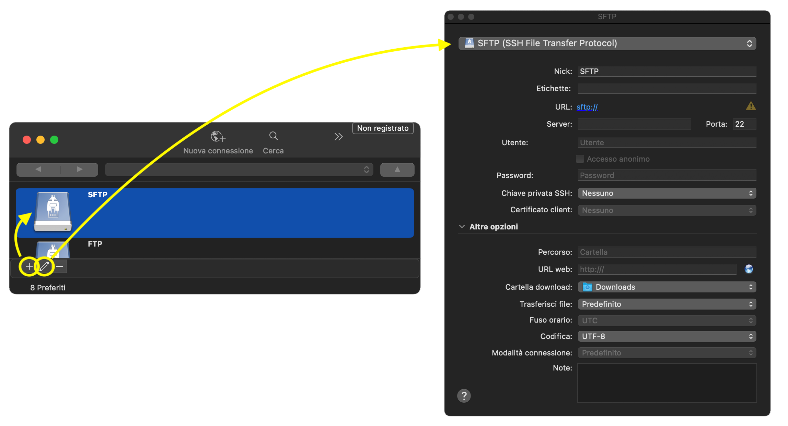

Note: Use `Command + R` to refresh files when changes are not immediately visible.

<br>
<br>
<br>

<center><h1>🐍 PyCharm</h1></center>

## 1️⃣ Setting Up a Remote Interpreter

1. Open **Preferences** inside the PyCharm to connect with a Remote Interpreter.

   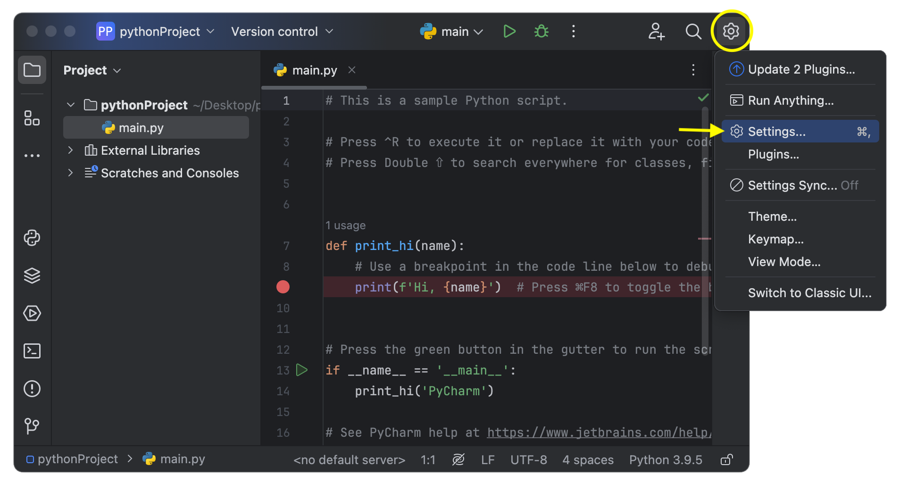

2. Go to **Python Interpreter** ➡️ **Add Interpreter** ➡️ **On SSH**.

   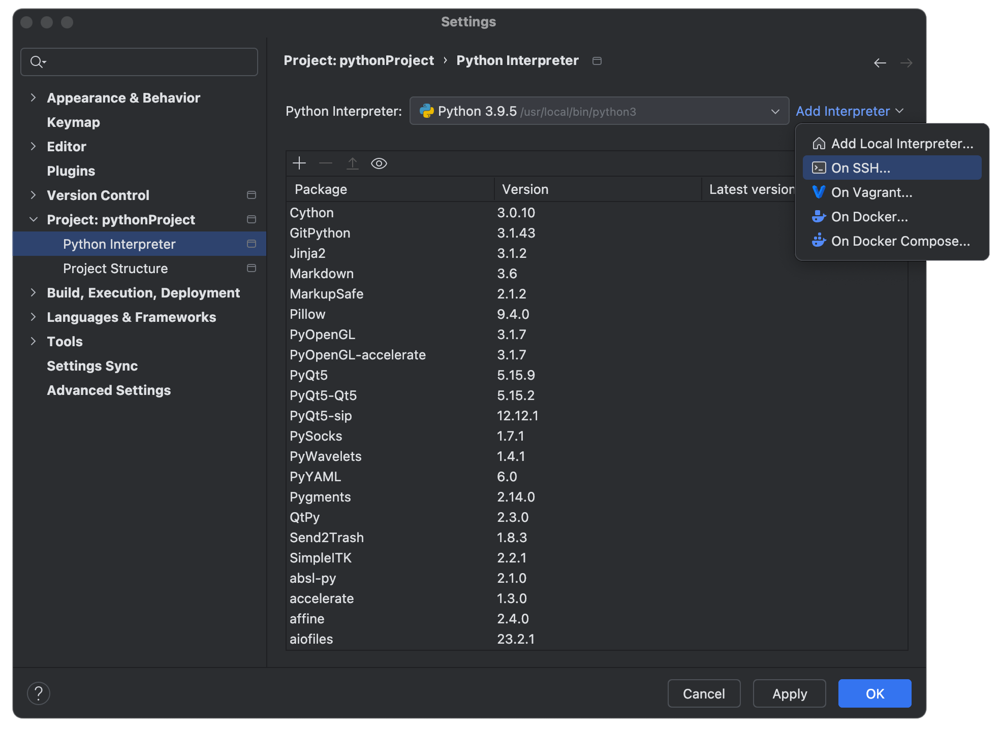

3. Enter the required details (or pick your `~/.ssh/config` alias if PyCharm offers it):
   - **Host** (server IP address or alias).
   - **Port Number**.
   - **Username**.

   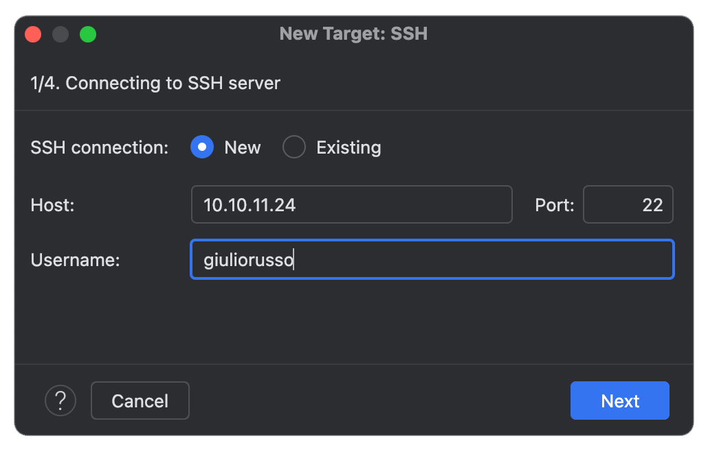

4. Follow the steps to verify authentication.

   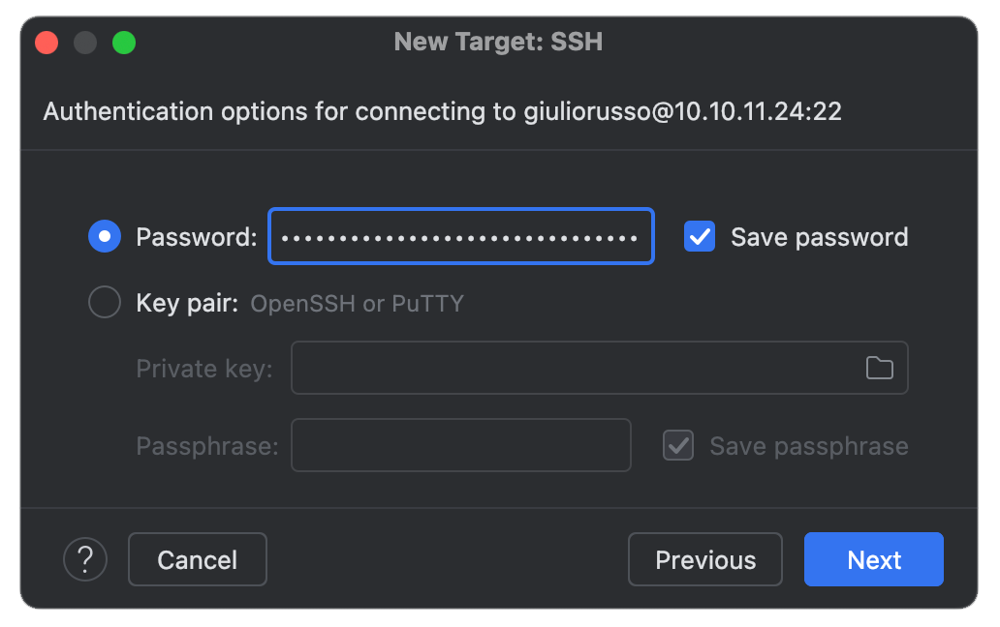
   <br>
   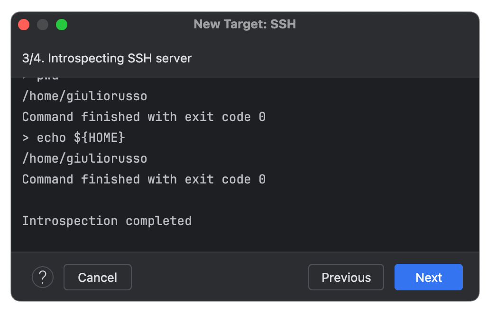

Select the appropriate Python environment or System interpreter path on the Server:
- **Virtual Environment**: if you have a specific virtual environment for your project, select the path of its python3 on the Server (e.g., `/home/user/pythonProject/.venv/bin/python3` or if you use miniconda `/home/user/miniconda3/envs/myenv/bin/python3`)
- **System Interpreter**: if you use a global interpreter without a specific virtual environment, select the path of its python3 on the Server (e.g., `/usr/bin/python3` or if you use the miniconda base interpreter `/home/user/miniconda3/bin/python3`)

<br>

   In case you use a specific virtual environment, specify the path to the interpreter of the specific environment: <br>
   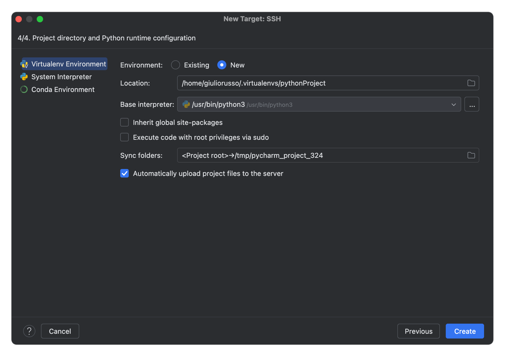

   In case you use a global interpreter, specify the path to the global Python interpreter: <br>
   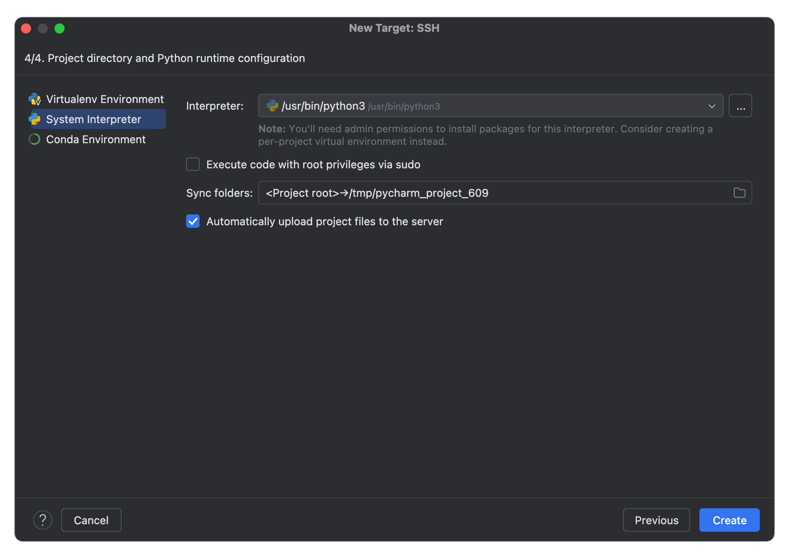

   In case you use Conda, specify the path to the base environment interpreter, or any other interpreter of a specific virtual environment: <br>
   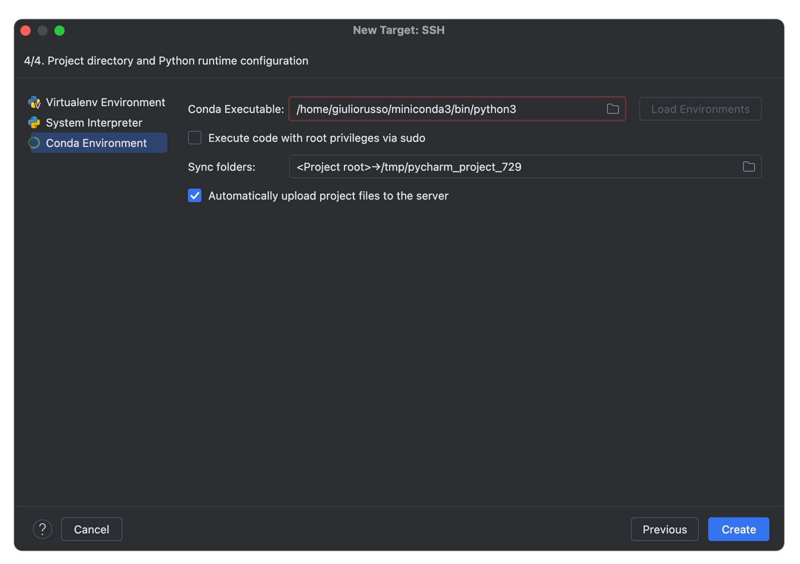

<br>

## 2️⃣ Deployment on Remote Server

To upload files to a remote server:

1. Open **Preferences** ➡️ **Deployment**. <br>

<br>
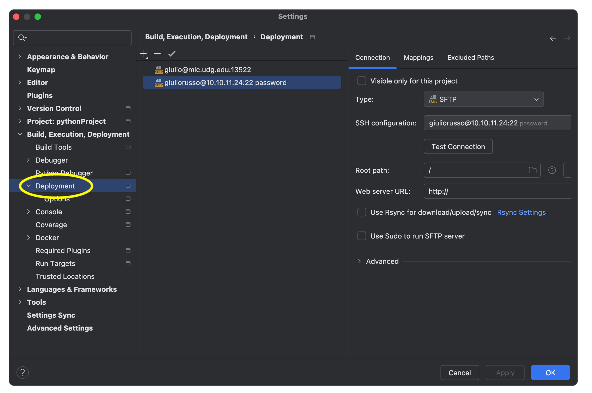

2. Add a new server configuration.

   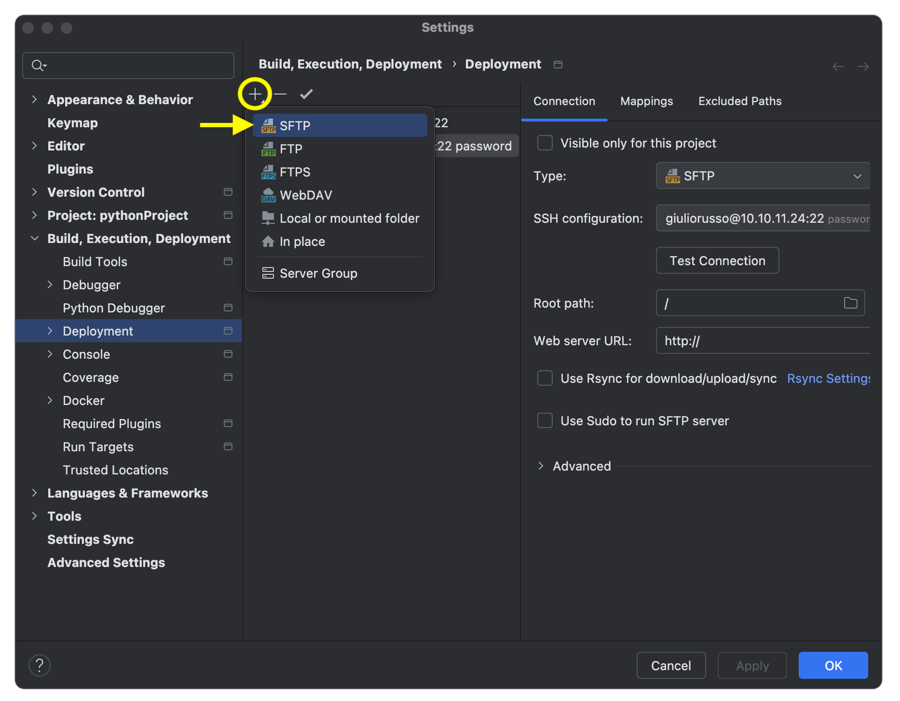
   <br>
      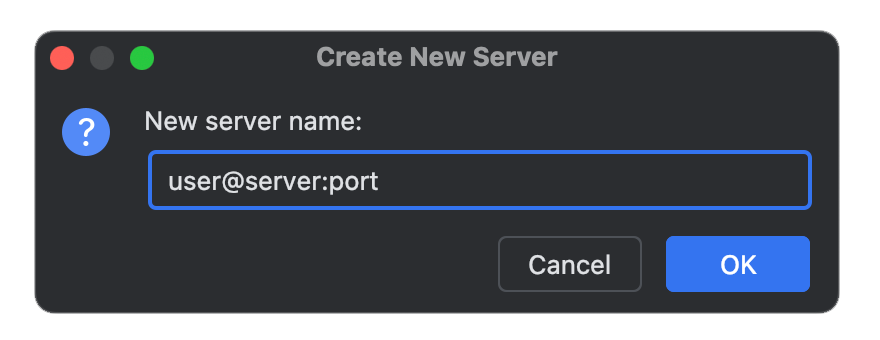

3. Map the local project path to the remote server's directory at `Deployment path`.

      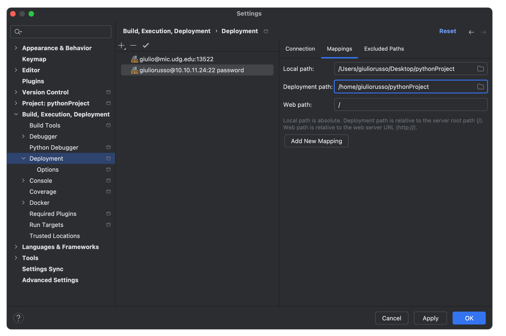


   Files and Folders can be uploaded with right-click on the target content and click on `Upload to <your_server>`

   Also, you can select the option `Automatic Upload` in `Tools` that will load every modification directly on the Server.

<br>

### 🚨 Pay Attention

If a content is uploaded to the Server, but deleted on your local project, this will NOT be deleted also on the Server. In this case you will need to delete the content also on the Server.

<br>
<br>
<br>

<center><h1>🥏 Visual Studio Code Remote</h1></center>

<br>

1. Install the **Remote SSH** extension.

2. If you already created `~/.ssh/config` above, VS Code picks it up automatically — the alias (e.g. `myserver`) will just appear in the Remote SSH host list. Otherwise, configure it now:
   ```ssh
   Host myserver
       HostName 192.168.1.10
       User username
       Port 2222
   ```

3. Connect via the Remote SSH icon in VS Code.

   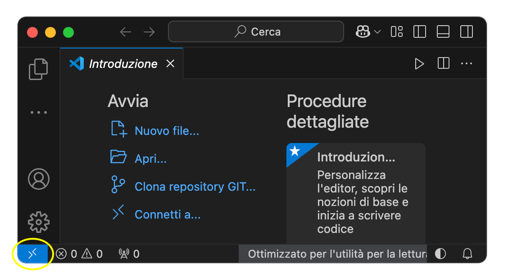

   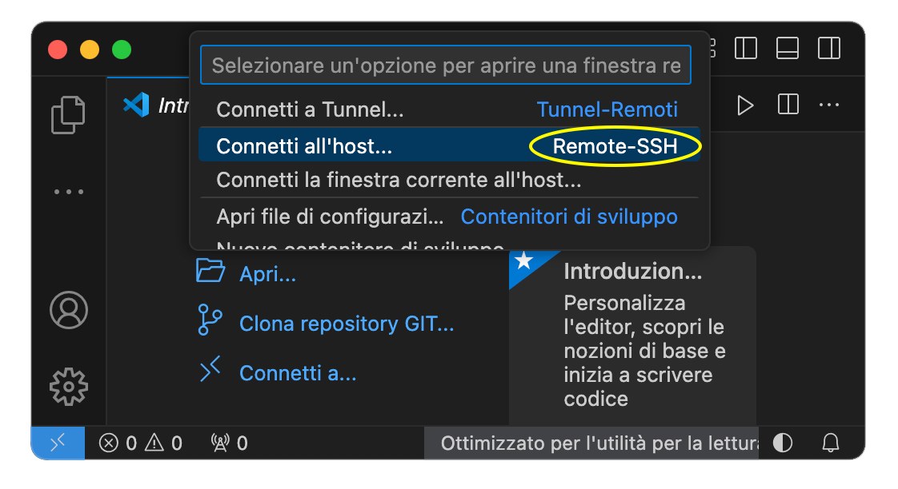

   All the configured remote connections will be visualized here:

   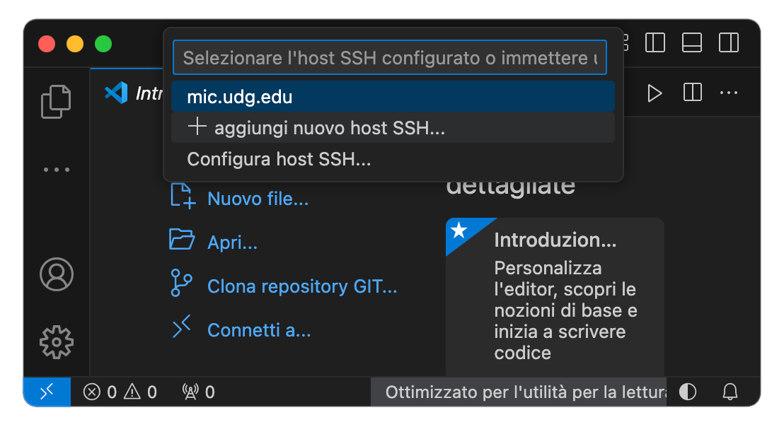

<br>
<br>
<br>

<center><h1>📟 Background Sessions</h1></center>

<br>

## ⚒️ Using `tmux` for Persistent Sessions

- Start a session: `tmux new -s <name>`
- List sessions: `tmux ls`
- Reattach to a session: `tmux a -t <name>`
- Attach if it exists, else create it (one command for both cases — the pattern you actually want in a reconnect script or muscle memory): `tmux new -A -s <name>`
- Detach from a session: press `Ctrl+b`, release, then press `d` (not a 3-key chord — `Ctrl+b` is the tmux prefix, `d` is the following command)
- Rename the current session: `Ctrl+b` then `$`
- Kill a session: `tmux kill-session -t <name>`
- Kill every session on the server (e.g. after a crashed/orphaned run): `tmux kill-server`
- Check whether you're currently inside a tmux session (useful in scripts): `echo $TMUX` — non-empty if inside one

Prefer this over `nohup` below whenever you want to check back on a running process interactively — you can reattach and see live output, not just a log file.

<br>

### 🪟 Windows and Panes

A session can hold multiple **windows** (like browser tabs) and each window can be split into multiple **panes** (like a tiling layout) — useful for e.g. watching `nvidia-smi` next to your training script without a second SSH connection:

| Action | Shortcut (after `Ctrl+b`) |
|---|---|
| New window | `c` |
| Next / previous window | `n` / `p` |
| Jump to window number | `0`-`9` |
| Rename current window | `,` |
| Split pane vertically (side by side) | `%` |
| Split pane horizontally (stacked) | `"` |
| Move between panes | arrow keys |
| Close current pane/window | `x` (asks to confirm) |

<br>

### 📜 Scrolling Through Output (Copy Mode)

Normal terminal scrollback (mouse wheel / Shift+PageUp) doesn't work inside tmux by default — you need **copy mode** to scroll back through a long training log:

1. Enter copy mode: `Ctrl+b` then `[`
2. Scroll with arrow keys / `PageUp` / `PageDown` (or search with `Ctrl+r`)
3. Exit copy mode: `q`

Alternatively, enable mouse support once in `~/.tmux.conf` (`echo "set -g mouse on" >> ~/.tmux.conf`, then `tmux kill-server` and start a new session) to scroll with the mouse wheel and click to switch panes, without memorizing copy-mode keys.

<br>

## 🛠️ Using `nohup` for Background Processes

Run even after disconnecting, redirecting both stdout and stderr to a log file:

- **Python Script**:
   ```bash
   nohup python3 -u script.py > output.log 2>&1 &
   ```

- **Bash Script**:
   ```bash
   nohup sh ./script.sh > output.log 2>&1 &
   ```

<br>
<br>
<br>

[Back to Index 🗂️](./README.md)
